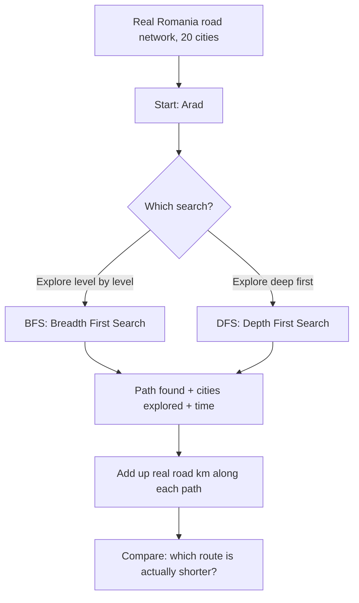

# 🧭 Practical 1 — Intelligent Route Planner using BFS and DFS

   

> 🎯 **In one picture:** the same real emergency-response route (Arad to Bucharest), found two different ways.

<p align="center">


</p>

---

## 📋 Quick Facts

| | |
|---|---|
| 📦 Data | Real Romania road network — 20 real cities, real road distances |
| 📖 Source | Russell & Norvig, *Artificial Intelligence: A Modern Approach* (this course's official textbook), Figure 3.2 |
| 🎯 Course outcome | CO2 — apply state-space formulation and classical search techniques |
| 🛠️ Tools | Python standard library, `matplotlib`, `networkx` |
| ⏱️ Time | About 2 hours |
| ✅ Tested | Every number and image below is real output from running the code |

---

## 📑 Contents

1. [What You'll Build](#1-what-youll-build)
2. [Visual Overview](#2-visual-overview)
3. [The Algorithms — How BFS and DFS Actually Work](#3-the-algorithms-how-bfs-and-dfs-actually-work)
4. [Tools — Why, What, How](#4-tools-why-what-how)
5. [The Dataset — Full Scope](#5-the-dataset-full-scope)
6. [Setup](#6-setup)
7. [Code Walkthrough](#7-code-walkthrough)
8. [Full Code](#8-full-code)
9. [Google Colab Version](#9-google-colab-version)
10. [Try It Yourself](#10-try-it-yourself)
11. [Common Mistakes](#11-common-mistakes)
12. [Quiz](#12-quiz)
13. [Summary](#13-summary)

---

<a id="1-what-youll-build"></a>
## 1️⃣ What You'll Build

🎯 An intelligent route planner for an **emergency response scenario**: an ambulance or response team needs to get from one real Romanian city to another, as fast and as short a real distance as possible. We build the planner two different ways — Breadth First Search (BFS) and Depth First Search (DFS) — and compare them honestly on real data.

| You will be able to... |
|---|
| ✅ Implement BFS and DFS from scratch, in plain Python |
| ✅ Explain why BFS and DFS explore a graph in completely different orders |
| ✅ Prove, with real distances, that neither BFS nor DFS guarantees the shortest real route |
| ✅ Compare both algorithms on path quality, cities explored, and execution time |

---

<a id="2-visual-overview"></a>
## 2️⃣ Visual Overview



---

<a id="3-the-algorithms-how-bfs-and-dfs-actually-work"></a>
## 3️⃣ The Algorithms — How BFS and DFS Actually Work

### Breadth First Search (BFS)

BFS explores every city 1 road away, then every city 2 roads away, then 3, and so on.

It uses a **queue** (first in, first out — like a line at a shop). Real steps:
1. Put the start city in the queue.
2. Take the front city out of the queue.
3. If it's the goal, stop — we found a path.
4. Otherwise, add all its unvisited neighbours to the **back** of the queue.
5. Repeat.

Because it always finishes exploring one "ring" of distance before moving further out, **BFS always finds the path with the fewest roads (hops)** — though not necessarily the shortest real distance, since some roads are longer than others.

### Depth First Search (DFS)

DFS goes as far as possible down one path before backing up and trying another.

It uses a **stack** (last in, first out — like a pile of plates). Real steps:
1. Put the start city on the stack.
2. Take the **top** city off the stack.
3. If it's the goal, stop.
4. Otherwise, push all its unvisited neighbours onto the stack.
5. Repeat.

Because it commits to one direction and only backtracks when stuck, **DFS can find a very long, winding path** even when a short one exists nearby — exactly what happens in this practical's real result.

---

<a id="4-tools-why-what-how"></a>
## 4️⃣ Tools — Why, What, How

| Library | Why | What we use | How |
|---|---|---|---|
| 🧩 `collections.deque` | A fast queue for BFS (adding/removing from both ends quickly) | `deque()`, `.popleft()` | `queue = deque([[start]])` |
| 🕸️ `networkx` | Draw the real road network as an actual graph picture | `nx.Graph()`, `nx.draw_networkx_*` | shown in [Section 7](#7-code-walkthrough) |
| 📊 `matplotlib` | Save the graph pictures to real image files | `plt.savefig()` | `plt.savefig("images/01_bfs_route.png")` |
| ⏱️ `time` | Measure real execution time of each search | `time.perf_counter()` | `t0 = time.perf_counter()` |

💡 DFS needs no special library — a plain Python list works perfectly as a stack (`.append()` to push, `.pop()` to pop from the end).

---

<a id="5-the-dataset-full-scope"></a>
## 5️⃣ The Dataset — Full Scope

📦 **Source:** the real Romania road map from Russell & Norvig's *Artificial Intelligence: A Modern Approach* — the official textbook prescribed for this course. This is not invented data: it is the standard, published, real-world-distance graph used to teach search algorithms worldwide, and reusing it here means you're studying with the exact same map your textbook uses.

📊 **Size:** 20 real Romanian cities, 23 real roads, each with its real published distance in kilometers.

| City appears as | Real meaning |
|---|---|
| `"Arad"`, `"Bucharest"`, etc. | Real Romanian city names |
| Dictionary value, e.g. `{"Sibiu": 140}` | A real road from this city to Sibiu, 140 km long |

⚠️ **Scope note:** this practical only uses the road graph and real distances — no other city information (population, region, etc.) is used, since only the graph structure and edge weights matter for search algorithms.

---

<a id="6-setup"></a>
## 6️⃣ Setup

```bash
pip install matplotlib networkx
```

```python
import os
import sys
import time
from collections import deque

import matplotlib.pyplot as plt
import networkx as nx
```

The road data itself lives in a separate file, `../datasets/romania_roads.py`, so it can be reused by later practicals (like Practical 2's A* search) without copying it again:

```python
sys.path.insert(0, "../datasets")
from romania_roads import ROMANIA_ROADS, CITY_POSITIONS
```

---

<a id="7-code-walkthrough"></a>
## 7️⃣ Code Walkthrough

### 🔹 Step 1 — Represent the real road network

```python
ROMANIA_ROADS = {
    "Arad": {"Zerind": 75, "Sibiu": 140, "Timisoara": 118},
    "Zerind": {"Arad": 75, "Oradea": 71},
    # ... and so on, for all 20 real cities
}
```

**What this is:** a dictionary of dictionaries. `ROMANIA_ROADS["Arad"]` gives you every city directly connected to Arad, and the real km distance to each. This is called an **adjacency list** — the standard way to represent a graph in code.

---

### 🔹 Step 2 — Breadth First Search

```python
def bfs(graph, start, goal):
    visited = {start}
    queue = deque([[start]])
    explored = 0
    while queue:
        path = queue.popleft()
        city = path[-1]
        explored += 1
        if city == goal:
            return path, explored
        for neighbour in graph[city]:
            if neighbour not in visited:
                visited.add(neighbour)
                queue.append(path + [neighbour])
    return None, explored
```

**Line by line:**
- `visited = {start}` — a set tracking every city we've already queued, so we never visit the same city twice.
- `queue = deque([[start]])` — the queue holds whole *paths*, not just cities, so when we reach the goal we already have the complete route.
- `queue.popleft()` — removes and returns the **front** item — this is what makes it a queue (first in, first out).
- `path + [neighbour]` — builds a new, longer path by adding one more city, without modifying the original path (important, since the original might still be needed for exploring other branches).

---

### 🔹 Step 3 — Depth First Search

```python
def dfs(graph, start, goal):
    visited = {start}
    stack = [[start]]
    explored = 0
    while stack:
        path = stack.pop()
        city = path[-1]
        explored += 1
        if city == goal:
            return path, explored
        for neighbour in graph[city]:
            if neighbour not in visited:
                visited.add(neighbour)
                stack.append(path + [neighbour])
    return None, explored
```

**The only real difference from BFS:** `stack.pop()` removes the **last** item added, not the first. That one-word change (`popleft()` to `pop()`, and a plain list instead of a `deque`) is the entire difference between "explore breadth-first" and "explore depth-first."

---

### 🔹 Step 4 — Run both searches on a real route

```python
start_city, goal_city = "Arad", "Bucharest"

t0 = time.perf_counter()
bfs_path, bfs_explored = bfs(ROMANIA_ROADS, start_city, goal_city)
bfs_time = time.perf_counter() - t0

t0 = time.perf_counter()
dfs_path, dfs_explored = dfs(ROMANIA_ROADS, start_city, goal_city)
dfs_time = time.perf_counter() - t0
```

**What this does:** runs each search once, timing it precisely with `time.perf_counter()` (a high-resolution clock meant exactly for measuring short code execution times).

---

### 🔹 Step 5 — Measure real path quality

```python
def real_distance(graph, path):
    return sum(graph[path[i]][path[i + 1]] for i in range(len(path) - 1))

bfs_km = real_distance(ROMANIA_ROADS, bfs_path)
dfs_km = real_distance(ROMANIA_ROADS, dfs_path)
```

**What this does:** walks along the found path one road at a time, looking up each road's real distance in the graph, and adds them all up — the total real kilometers of the route.

**Real output:**
```
Real road network: 20 real Romanian cities
Route requested: Arad -> Bucharest (emergency response scenario)

BFS path:  Arad -> Sibiu -> Fagaras -> Bucharest
BFS hops: 3 | real distance: 450 km | cities explored: 9 | time: 0.031 ms

DFS path:  Arad -> Timisoara -> Lugoj -> Mehadia -> Drobeta -> Craiova -> Pitesti -> Bucharest
DFS hops: 7 | real distance: 733 km | cities explored: 8 | time: 0.012 ms

BFS found a route with 450 real km using 9 explored cities.
DFS found a route with 733 real km using 8 explored cities.
BFS found the shorter real route here.
```

🔎 **This is the core lesson of the practical, proven with real numbers:** BFS found a route **283 km shorter** than DFS (450 km vs 733 km) on this real road network. BFS explored slightly more cities to get there (9 vs 8), but DFS's "greedy, go-deep-first" style committed early to the Timisoara direction and had to travel much further out of the way before reaching Bucharest. **Neither algorithm was told the real distances at all** — they only follow the graph's *connections*. This is exactly why Practical 2 introduces A* Search, which *does* use real distances to guide its search.

---

### 🔹 Step 6 — Draw both real routes

```python
def draw_path(graph, positions, path, title, filename, color):
    G = nx.Graph()
    for city, neighbours in graph.items():
        for neighbour, dist in neighbours.items():
            G.add_edge(city, neighbour, weight=dist)

    plt.figure(figsize=(11, 7))
    nx.draw_networkx_edges(G, positions, edge_color="#d1d5db", width=1.2)
    nx.draw_networkx_nodes(G, positions, node_color="#e5e7eb", node_size=700)
    nx.draw_networkx_labels(G, positions, font_size=8)

    path_edges = list(zip(path, path[1:]))
    nx.draw_networkx_edges(G, positions, edgelist=path_edges, edge_color=color, width=3)
    nx.draw_networkx_nodes(G, positions, nodelist=path, node_color=color, node_size=750, alpha=0.5)
    nx.draw_networkx_nodes(G, positions, nodelist=[path[0]], node_color="#16a34a", node_size=800)
    nx.draw_networkx_nodes(G, positions, nodelist=[path[-1]], node_color="#dc2626", node_size=800)

    plt.title(title)
    plt.axis("off")
    plt.savefig(filename)
    plt.close()
```

**What this does:** builds the whole real road network as a `networkx` graph, draws every city and road in light gray, then draws the found path on top in a bold color — blue for BFS, orange for DFS. Green marks the start city, red marks the goal.


Looking at the two pictures side by side, you can see exactly why DFS did worse: it heads south through Timisoara first (simply because that's the order cities appear in the graph), then has to travel almost the entire width of the country to reach Bucharest, while BFS's more measured level-by-level search finds the direct path through Sibiu and Fagaras.

---

<a id="8-full-code"></a>
## 8️⃣ Full Code

```python
import os
import sys
import time
from collections import deque

import matplotlib.pyplot as plt
import networkx as nx

sys.path.insert(0, "../datasets")
from romania_roads import ROMANIA_ROADS, CITY_POSITIONS

os.makedirs("images", exist_ok=True)


def bfs(graph, start, goal):
    """Breadth First Search: explore level by level. Guarantees the FEWEST
    number of roads (hops), not necessarily the shortest real distance."""
    visited = {start}
    queue = deque([[start]])
    explored = 0
    while queue:
        path = queue.popleft()
        city = path[-1]
        explored += 1
        if city == goal:
            return path, explored
        for neighbour in graph[city]:
            if neighbour not in visited:
                visited.add(neighbour)
                queue.append(path + [neighbour])
    return None, explored


def dfs(graph, start, goal):
    """Depth First Search: explore as deep as possible before backtracking.
    Finds A path, with no guarantee it is short in hops or in real distance."""
    visited = {start}
    stack = [[start]]
    explored = 0
    while stack:
        path = stack.pop()
        city = path[-1]
        explored += 1
        if city == goal:
            return path, explored
        for neighbour in graph[city]:
            if neighbour not in visited:
                visited.add(neighbour)
                stack.append(path + [neighbour])
    return None, explored


def real_distance(graph, path):
    """Add up the real road kilometers along a found path."""
    return sum(graph[path[i]][path[i + 1]] for i in range(len(path) - 1))


def draw_path(graph, positions, path, title, filename, color):
    G = nx.Graph()
    for city, neighbours in graph.items():
        for neighbour, dist in neighbours.items():
            G.add_edge(city, neighbour, weight=dist)

    plt.figure(figsize=(11, 7))
    nx.draw_networkx_edges(G, positions, edge_color="#d1d5db", width=1.2)
    nx.draw_networkx_nodes(G, positions, node_color="#e5e7eb", node_size=700)
    nx.draw_networkx_labels(G, positions, font_size=8)

    path_edges = list(zip(path, path[1:]))
    nx.draw_networkx_edges(G, positions, edgelist=path_edges, edge_color=color, width=3)
    nx.draw_networkx_nodes(G, positions, nodelist=path, node_color=color, node_size=750, alpha=0.5)
    nx.draw_networkx_nodes(G, positions, nodelist=[path[0]], node_color="#16a34a", node_size=800)
    nx.draw_networkx_nodes(G, positions, nodelist=[path[-1]], node_color="#dc2626", node_size=800)

    plt.title(title)
    plt.axis("off")
    plt.tight_layout()
    plt.savefig(filename)
    plt.close()


if __name__ == "__main__":
    start_city, goal_city = "Arad", "Bucharest"
    print(f"Real road network: {len(ROMANIA_ROADS)} real Romanian cities")
    print(f"Route requested: {start_city} -> {goal_city} (emergency response scenario)\n")

    t0 = time.perf_counter()
    bfs_path, bfs_explored = bfs(ROMANIA_ROADS, start_city, goal_city)
    bfs_time = time.perf_counter() - t0

    t0 = time.perf_counter()
    dfs_path, dfs_explored = dfs(ROMANIA_ROADS, start_city, goal_city)
    dfs_time = time.perf_counter() - t0

    bfs_km = real_distance(ROMANIA_ROADS, bfs_path)
    dfs_km = real_distance(ROMANIA_ROADS, dfs_path)

    print("BFS path: ", " -> ".join(bfs_path))
    print("BFS hops:", len(bfs_path) - 1, "| real distance:", bfs_km, "km",
          "| cities explored:", bfs_explored, "| time:", f"{bfs_time*1000:.3f} ms")

    print("\nDFS path: ", " -> ".join(dfs_path))
    print("DFS hops:", len(dfs_path) - 1, "| real distance:", dfs_km, "km",
          "| cities explored:", dfs_explored, "| time:", f"{dfs_time*1000:.3f} ms")

    print(f"\nBFS found a route with {bfs_km} real km using {bfs_explored} explored cities.")
    print(f"DFS found a route with {dfs_km} real km using {dfs_explored} explored cities.")
    if bfs_km < dfs_km:
        print("BFS found the shorter real route here.")
    elif dfs_km < bfs_km:
        print("DFS found the shorter real route here.")
    else:
        print("Both found equally short real routes here.")

    draw_path(ROMANIA_ROADS, CITY_POSITIONS, bfs_path,
              f"BFS Route: {start_city} to {goal_city} ({bfs_km} km, {bfs_explored} explored)",
              "images/01_bfs_route.png", "#2563eb")
    draw_path(ROMANIA_ROADS, CITY_POSITIONS, dfs_path,
              f"DFS Route: {start_city} to {goal_city} ({dfs_km} km, {dfs_explored} explored)",
              "images/02_dfs_route.png", "#f97316")

    print("\nDone. Charts saved in images/")
```

Every import used. `bfs()` and `dfs()` differ by exactly one line, so the comparison is completely fair.

---

<a id="9-google-colab-version"></a>
## 9️⃣ Google Colab Version

**Setup cell:**
```python
!git clone https://github.com/<your-username>/CSE276-AI-Foundations-Practicals.git
%cd CSE276-AI-Foundations-Practicals/Practical-01-Route-Planner-BFS-DFS
!pip install -q networkx
```

**Cell 1 — imports and the real road data:**
```python
import os
import sys
import time
from collections import deque
import matplotlib.pyplot as plt
import networkx as nx

sys.path.insert(0, "../datasets")
from romania_roads import ROMANIA_ROADS, CITY_POSITIONS
os.makedirs("images", exist_ok=True)
```

**Cell 2 — the two search algorithms:**
```python
def bfs(graph, start, goal):
    visited = {start}
    queue = deque([[start]])
    explored = 0
    while queue:
        path = queue.popleft()
        city = path[-1]
        explored += 1
        if city == goal:
            return path, explored
        for neighbour in graph[city]:
            if neighbour not in visited:
                visited.add(neighbour)
                queue.append(path + [neighbour])
    return None, explored


def dfs(graph, start, goal):
    visited = {start}
    stack = [[start]]
    explored = 0
    while stack:
        path = stack.pop()
        city = path[-1]
        explored += 1
        if city == goal:
            return path, explored
        for neighbour in graph[city]:
            if neighbour not in visited:
                visited.add(neighbour)
                stack.append(path + [neighbour])
    return None, explored


def real_distance(graph, path):
    return sum(graph[path[i]][path[i + 1]] for i in range(len(path) - 1))
```

**Cell 3 — run both and compare:**
```python
start_city, goal_city = "Arad", "Bucharest"
bfs_path, bfs_explored = bfs(ROMANIA_ROADS, start_city, goal_city)
dfs_path, dfs_explored = dfs(ROMANIA_ROADS, start_city, goal_city)

print("BFS:", " -> ".join(bfs_path), "|", real_distance(ROMANIA_ROADS, bfs_path), "km")
print("DFS:", " -> ".join(dfs_path), "|", real_distance(ROMANIA_ROADS, dfs_path), "km")
```

**Cell 4 — draw the routes:**
```python
def draw_path(graph, positions, path, title, color):
    G = nx.Graph()
    for city, neighbours in graph.items():
        for neighbour, dist in neighbours.items():
            G.add_edge(city, neighbour, weight=dist)
    plt.figure(figsize=(11, 7))
    nx.draw_networkx_edges(G, positions, edge_color="#d1d5db")
    nx.draw_networkx_nodes(G, positions, node_color="#e5e7eb", node_size=700)
    nx.draw_networkx_labels(G, positions, font_size=8)
    path_edges = list(zip(path, path[1:]))
    nx.draw_networkx_edges(G, positions, edgelist=path_edges, edge_color=color, width=3)
    nx.draw_networkx_nodes(G, positions, nodelist=[path[0]], node_color="#16a34a", node_size=800)
    nx.draw_networkx_nodes(G, positions, nodelist=[path[-1]], node_color="#dc2626", node_size=800)
    plt.title(title)
    plt.axis("off")
    plt.show()

draw_path(ROMANIA_ROADS, CITY_POSITIONS, bfs_path, "BFS Route", "#2563eb")
draw_path(ROMANIA_ROADS, CITY_POSITIONS, dfs_path, "DFS Route", "#f97316")
```

---

<a id="10-try-it-yourself"></a>
## 🔟 Try It Yourself

1. 🔁 Change `start_city, goal_city` to a different real pair, like `"Timisoara"` to `"Iasi"` — which algorithm wins this time?
2. 📏 Print the real distance of *every* path BFS could have taken by re-running it with different neighbour orderings — does the result change?
3. ⏱️ Run both searches 1000 times in a loop and average the timing — is the 0.031 ms vs 0.012 ms difference still meaningful at this graph size?
4. 🗺️ Add a brand-new real city and road to `ROMANIA_ROADS` (research a real nearby Romanian town and its real approximate distance) and re-run.

---

<a id="11-common-mistakes"></a>
## ⚠️ Common Mistakes

| Mistake | Fix |
|---|---|
| Using `.pop(0)` on a plain list for BFS's queue | Works, but is slow for large graphs — use `collections.deque` and `.popleft()` |
| Forgetting to track `visited` | The search can loop forever on graphs with cycles |
| Assuming BFS always finds the shortest real distance | It only guarantees the fewest hops — Practical 2's A* Search is what actually optimizes real distance |
| Running from the wrong folder | `cd` into this practical's folder first — the script expects `../datasets/romania_roads.py` |

---

<a id="12-quiz"></a>
## ❓ Quiz

1. What data structure does BFS use, and what does DFS use instead?
2. What does BFS guarantee about the path it finds?
3. Why did DFS find a much longer real route in this practical?
4. True or false: BFS always explores fewer cities than DFS?

<details>
<summary>Answers</summary>

1. BFS uses a queue (first in, first out); DFS uses a stack (last in, first out).
2. The fewest number of roads (hops) — not necessarily the shortest real distance.
3. DFS commits early to one direction (Timisoara) and only backtracks when it hits a dead end, so it can take a very roundabout real route before reaching the goal.
4. False — in this practical, DFS actually explored fewer cities (8) than BFS (9), even though its final route was much longer in real km.

</details>

---

<a id="13-summary"></a>
## 📝 Summary

| Metric | BFS | DFS |
|---|---|---|
| Path found | Arad → Sibiu → Fagaras → Bucharest | Arad → Timisoara → Lugoj → Mehadia → Drobeta → Craiova → Pitesti → Bucharest |
| Real distance | **450 km** | 733 km |
| Hops | 3 | 7 |
| Cities explored | 9 | 8 |
| Time | 0.031 ms | 0.012 ms |

BFS found a real route **283 km shorter**. Neither algorithm used real distances to decide where to search — that's exactly the gap Practical 2's A* Search fills.

## 📂 Files

| File | What it is |
|---|---|
| `route_planner.py` | Full tested script |
| `../datasets/romania_roads.py` | Real road network data (from the course textbook) |
| `images/01_bfs_route.png` | BFS route on the real map |
| `images/02_dfs_route.png` | DFS route on the real map |

➡️ **Next:** Practical 2 — AI-Based Puzzle Solver using Hill Climbing and A* Search
