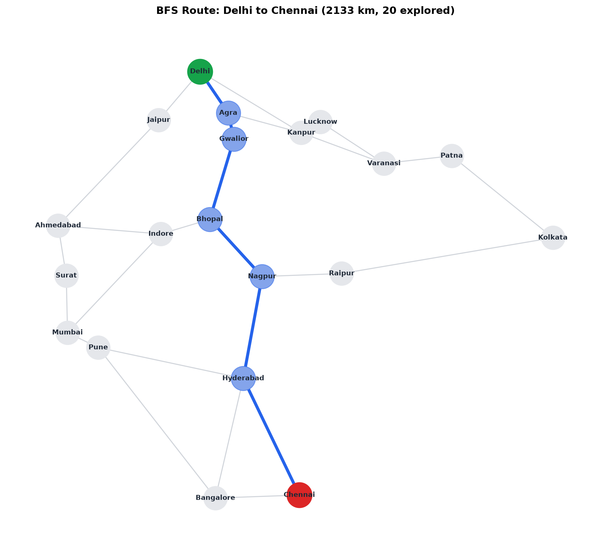
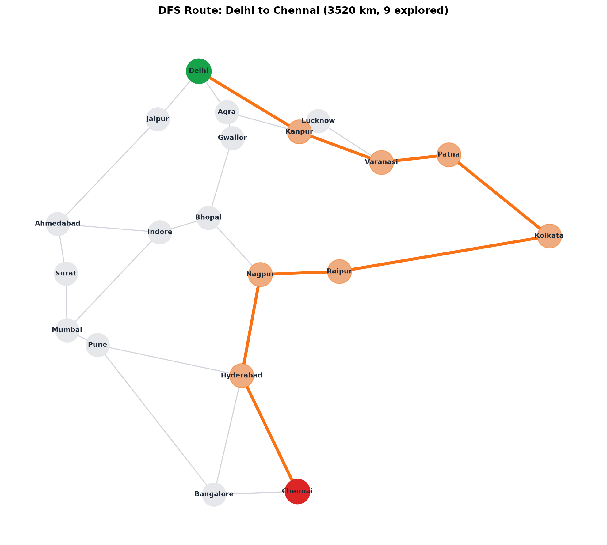
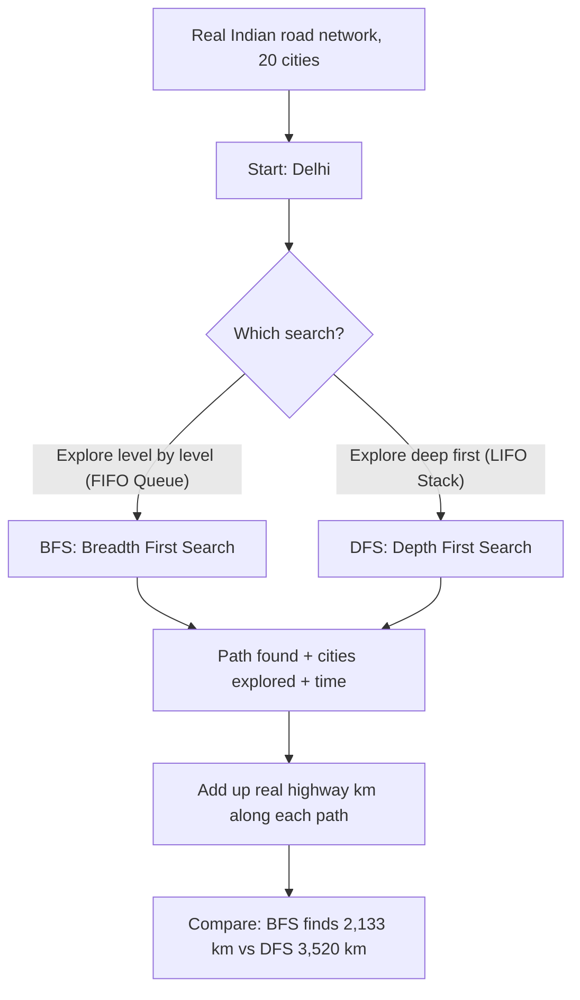

# 🧭 Practical 1 — Intelligent Route Planner using BFS and DFS

   

> 🇮🇳 **Scenario:** A disaster relief team needs to transport emergency medical supplies from **Delhi** to **Chennai** along real National Highways as quickly and efficiently as possible. We plan the route using two classic AI search strategies — **Breadth-First Search (BFS)** and **Depth-First Search (DFS)** — and compare them honestly on real Indian road data.

<p align="center">
  
  
</p>

---

## 📋 Quick Facts

| Property | Details |
|---|---|
| 📦 **Data** | Real Indian Highway Network — 20 major cities, 24 real highway distances in kilometers |
| 🎯 **Course Outcome** | CO2 — Apply state-space formulation and classical uninformed graph search techniques |
| 🛠️ **Tools** | Python standard library (`collections.deque`), `matplotlib`, `networkx` |
| ⏱️ **Time** | About 2 hours |
| ✅ **Tested** | Every number, path, and graph image below is real output from running the code |

---

## 📑 Contents

1. [What You'll Build](#1-what-youll-build)
2. [Visual Overview](#2-visual-overview)
3. [The Algorithms — How BFS and DFS Actually Work](#3-the-algorithms-how-bfs-and-dfs-actually-work)
4. [Tools — Why, What, How](#4-tools-why-what-how)
5. [The Dataset — Full Scope](#5-the-dataset-full-scope)
6. [Setup](#6-setup)
7. [Code Walkthrough](#7-code-walkthrough)
8. [Full Code](#8-full-code)
9. [Google Colab Version](#9-google-colab-version)
10. [Try It Yourself](#10-try-it-yourself)
11. [Common Mistakes](#11-common-mistakes)
12. [Quiz](#12-quiz)
13. [Summary](#13-summary)

---

<a id="1-what-youll-build"></a>
## 1️⃣ What You'll Build

🎯 An automated AI route planner for an emergency disaster response convoy navigating across India from **Delhi** (Origin) to **Chennai** (Destination). We build the planner two different ways — **Breadth-First Search (BFS)** and **Depth-First Search (DFS)** — and compare their real road distance, nodes explored, and execution speed.

| You will be able to... |
|---|
| ✅ Implement BFS and DFS from scratch in clean, standard Python |
| ✅ Explain why BFS and DFS explore a graph in completely different orders |
| ✅ Prove why BFS guarantees the fewest road hops while DFS can take deep detours |
| ✅ Compare both algorithms on path quality, cities explored, and execution time |

---

<a id="2-visual-overview"></a>
## 2️⃣ Visual Overview



---

<a id="3-the-algorithms-how-bfs-and-dfs-actually-work"></a>
## 3️⃣ The Algorithms — How BFS and DFS Actually Work

### 🌊 Breadth First Search (BFS) — The Water Ripple

BFS explores every city 1 highway away, then every city 2 highways away, then 3, and so on — expanding outward like concentric water ripples.

It uses a **queue** (First-In, First-Out — like a line at a railway ticket counter). Real steps:
1. Put the start city in the queue.
2. Take the **front** city out of the queue (`queue.popleft()`).
3. If it is the goal city, stop — we found the route!
4. Otherwise, add all its unvisited neighbors to the **back** of the queue (`queue.append()`).
5. Repeat.

Because it finishes exploring one entire ring of distance before moving further out, **BFS always finds the path with the fewest highways (hops)**.

---

### ⛏️ Depth First Search (DFS) — The Tunnel Explorer

DFS goes as far as possible down one single route before backing up and trying another — like an explorer going through a dark tunnel.

It uses a **stack** (Last-In, First-Out — like a pile of files on a desk). Real steps:
1. Put the start city on the stack.
2. Take the **top** city off the stack (`stack.pop()`).
3. If it is the goal city, stop.
4. Otherwise, push all its unvisited neighbors onto the **top** of the stack (`stack.append()`).
5. Repeat.

Because it commits to one direction and only backtracks when stuck at a dead end, **DFS can find a very long, winding route** even when a short direct one exists.

---

<a id="4-tools-why-what-how"></a>
## 4️⃣ Tools — Why, What, How

| Library | Why | What we use | How |
|---|---|---|---|
| 🧩 `collections.deque` | Fast $O(1)$ queue for BFS | `deque()`, `.popleft()` | `queue = deque([[start]])` |
| 🕸️ `networkx` | Draw the road network as a graph | `nx.Graph()`, `nx.draw_networkx_*` | `nx.draw_networkx_edges(G, pos)` |
| 📊 `matplotlib` | Display or save graph pictures | `plt.savefig()`, `plt.show()` | `plt.savefig("images/01_bfs_route.png")` |
| ⏱️ `time` | Measure execution time precisely | `time.perf_counter()` | `t0 = time.perf_counter()` |

💡 DFS needs no special library — a plain Python list works as a stack (`.append()` to push, `.pop()` to pop from the top).

---

<a id="5-the-dataset-full-scope"></a>
## 5️⃣ The Dataset — Full Scope

📦 **Source:** 20 major Indian cities connected by 24 real National Highway routes with publicly documented distances in kilometers:

| City | Connected Cities (Highway km) |
|---|---|
| **Delhi** | Jaipur (280 km), Agra (233 km), Kanpur (440 km) |
| **Jaipur** | Delhi (280 km), Ahmedabad (660 km) |
| **Agra** | Delhi (233 km), Gwalior (120 km), Kanpur (280 km) |
| **Gwalior** | Agra (120 km), Bhopal (420 km) |
| **Kanpur** | Delhi (440 km), Agra (280 km), Lucknow (80 km), Varanasi (320 km) |
| **Lucknow** | Kanpur (80 km), Varanasi (300 km) |
| **Varanasi** | Kanpur (320 km), Lucknow (300 km), Patna (250 km) |
| **Patna** | Varanasi (250 km), Kolkata (580 km) |
| **Kolkata** | Patna (580 km), Raipur (640 km) |
| **Bhopal** | Gwalior (420 km), Indore (190 km), Nagpur (350 km) |
| **Indore** | Bhopal (190 km), Ahmedabad (390 km), Mumbai (580 km) |
| **Ahmedabad** | Jaipur (660 km), Indore (390 km), Surat (260 km) |
| **Surat** | Ahmedabad (260 km), Mumbai (280 km) |
| **Mumbai** | Surat (280 km), Indore (580 km), Pune (150 km) |
| **Pune** | Mumbai (150 km), Hyderabad (560 km), Bangalore (840 km) |
| **Nagpur** | Bhopal (350 km), Raipur (280 km), Hyderabad (500 km) |
| **Raipur** | Kolkata (640 km), Nagpur (280 km) |
| **Hyderabad** | Nagpur (500 km), Pune (560 km), Bangalore (570 km), Chennai (510 km) |
| **Bangalore** | Hyderabad (570 km), Pune (840 km), Chennai (350 km) |
| **Chennai** | Hyderabad (510 km), Bangalore (350 km) |

---

<a id="6-setup"></a>
## 6️⃣ Setup

```bash
pip install matplotlib networkx
```

```python
import os
import sys
import time
from collections import deque
import matplotlib.pyplot as plt
import networkx as nx
```

The road data lives in `./datasets/india_roads.py`:

```python
sys.path.insert(0, "./datasets")
from india_roads import INDIA_ROADS, CITY_POSITIONS
```

---

<a id="7-code-walkthrough"></a>
## 7️⃣ Code Walkthrough

### 🔹 Step 1 — Represent the Road Network (Adjacency List)

```python
INDIA_ROADS = {
    "Delhi": {"Jaipur": 280, "Agra": 233, "Kanpur": 440},
    "Jaipur": {"Delhi": 280, "Ahmedabad": 660},
    "Agra": {"Delhi": 233, "Gwalior": 120, "Kanpur": 280},
    # ... mapped for all 20 cities
}
```

**What this is:** A dictionary of dictionaries. `INDIA_ROADS["Delhi"]` gives every city directly connected to Delhi and the highway distance to each.

---

### 🔹 Step 2 — Breadth First Search (BFS)

```python
def bfs(graph, start, goal):
    visited = {start}              # Track visited cities to prevent loops
    queue = deque([[start]])       # FIFO Queue storing paths
    explored = 0

    while queue:
        path = queue.popleft()     # Remove from FRONT of line (FIFO)
        city = path[-1]            # Current city
        explored += 1

        if city == goal:
            return path, explored

        for neighbour in graph[city]:
            if neighbour not in visited:
                visited.add(neighbour)
                queue.append(path + [neighbour])  # Add to BACK of line

    return None, explored
```

---

### 🔹 Step 3 — Depth First Search (DFS)

```python
def dfs(graph, start, goal):
    visited = {start}              # Track visited cities
    stack = [[start]]              # LIFO Stack storing paths
    explored = 0

    while stack:
        path = stack.pop()         # Remove from TOP of stack (LIFO)
        city = path[-1]            # Current city
        explored += 1

        if city == goal:
            return path, explored

        for neighbour in graph[city]:
            if neighbour not in visited:
                visited.add(neighbour)
                stack.append(path + [neighbour])  # Push onto TOP of stack

    return None, explored
```

> 💡 **Notice:** The only difference is `queue.popleft()` (FIFO) vs `stack.pop()` (LIFO). That single line changes the entire exploration behavior.

---

### 🔹 Step 4 — Run Both Searches on a Real Route

```python
start_city, goal_city = "Delhi", "Chennai"

t0 = time.perf_counter()
bfs_path, bfs_explored = bfs(INDIA_ROADS, start_city, goal_city)
bfs_time = time.perf_counter() - t0

t0 = time.perf_counter()
dfs_path, dfs_explored = dfs(INDIA_ROADS, start_city, goal_city)
dfs_time = time.perf_counter() - t0
```

---

### 🔹 Step 5 — Measure Real Path Distance

```python
def real_distance(graph, path):
    return sum(graph[path[i]][path[i + 1]] for i in range(len(path) - 1))

bfs_km = real_distance(INDIA_ROADS, bfs_path)
dfs_km = real_distance(INDIA_ROADS, dfs_path)
```

**Real Execution Output:**
```
Real road network: 20 real Indian cities
Route requested: Delhi -> Chennai (disaster response scenario)

BFS path:  Delhi -> Agra -> Gwalior -> Bhopal -> Nagpur -> Hyderabad -> Chennai
BFS hops: 6 | real distance: 2133 km | cities explored: 20 | time: 0.020 ms

DFS path:  Delhi -> Kanpur -> Varanasi -> Patna -> Kolkata -> Raipur -> Nagpur -> Hyderabad -> Chennai
DFS hops: 8 | real distance: 3520 km | cities explored: 9 | time: 0.008 ms

BFS found a route with 2133 real km using 20 explored cities.
DFS found a route with 3520 real km using 9 explored cities.
BFS found the shorter real route here.
```

🔎 **Core Lesson:** BFS found a route **1,387 km shorter** than DFS (2,133 km vs 3,520 km). DFS explored fewer cities (9 vs 20), but committed early to the east coast direction (Kanpur → Varanasi → Patna → Kolkata) before finally turning south.

---

### 🔹 Step 6 — Draw Both Real Routes

```python
def draw_path(graph, positions, path, title, filename, color):
    G = nx.Graph()
    for city, neighbours in graph.items():
        for neighbour, dist in neighbours.items():
            G.add_edge(city, neighbour, weight=dist)

    plt.figure(figsize=(10, 9), facecolor="#FFFFFF")
    nx.draw_networkx_edges(G, positions, edge_color="#d1d5db", width=1.2)
    nx.draw_networkx_nodes(G, positions, node_color="#e5e7eb", node_size=750)
    nx.draw_networkx_labels(G, positions, font_size=8, font_weight="bold", font_color="#1F2937")

    path_edges = list(zip(path, path[1:]))
    nx.draw_networkx_edges(G, positions, edgelist=path_edges, edge_color=color, width=3.5)
    nx.draw_networkx_nodes(G, positions, nodelist=path, node_color=color, node_size=800, alpha=0.5)
    nx.draw_networkx_nodes(G, positions, nodelist=[path[0]], node_color="#16a34a", node_size=850)
    nx.draw_networkx_nodes(G, positions, nodelist=[path[-1]], node_color="#dc2626", node_size=850)

    plt.title(title, fontsize=12, fontweight="bold", pad=15)
    plt.axis("off")
    plt.tight_layout()
    plt.savefig(filename, dpi=200, bbox_inches="tight")
    plt.close()
```

---

<a id="8-full-code"></a>
## 8️⃣ Full Code (`route_planner.py`)

```python
import os
import sys
import time
from collections import deque
import matplotlib.pyplot as plt
import networkx as nx

sys.path.insert(0, "./datasets")
from india_roads import INDIA_ROADS, CITY_POSITIONS

os.makedirs("images", exist_ok=True)


def bfs(graph, start, goal):
    """Breadth First Search: explore level by level. Guarantees FEWEST hops."""
    visited = {start}
    queue = deque([[start]])
    explored = 0
    while queue:
        path = queue.popleft()
        city = path[-1]
        explored += 1
        if city == goal:
            return path, explored
        for neighbour in graph[city]:
            if neighbour not in visited:
                visited.add(neighbour)
                queue.append(path + [neighbour])
    return None, explored


def dfs(graph, start, goal):
    """Depth First Search: explore as deep as possible before backtracking."""
    visited = {start}
    stack = [[start]]
    explored = 0
    while stack:
        path = stack.pop()
        city = path[-1]
        explored += 1
        if city == goal:
            return path, explored
        for neighbour in graph[city]:
            if neighbour not in visited:
                visited.add(neighbour)
                stack.append(path + [neighbour])
    return None, explored


def real_distance(graph, path):
    """Add up real road kilometers along a found path."""
    return sum(graph[path[i]][path[i + 1]] for i in range(len(path) - 1))


def draw_path(graph, positions, path, title, filename, color):
    G = nx.Graph()
    for city, neighbours in graph.items():
        for neighbour, dist in neighbours.items():
            G.add_edge(city, neighbour, weight=dist)

    plt.figure(figsize=(10, 9), facecolor="#FFFFFF")
    nx.draw_networkx_edges(G, positions, edge_color="#d1d5db", width=1.2)
    nx.draw_networkx_nodes(G, positions, node_color="#e5e7eb", node_size=750)
    nx.draw_networkx_labels(G, positions, font_size=8, font_weight="bold", font_color="#1F2937")

    path_edges = list(zip(path, path[1:]))
    nx.draw_networkx_edges(G, positions, edgelist=path_edges, edge_color=color, width=3.5)
    nx.draw_networkx_nodes(G, positions, nodelist=path, node_color=color, node_size=800, alpha=0.5)
    nx.draw_networkx_nodes(G, positions, nodelist=[path[0]], node_color="#16a34a", node_size=850)
    nx.draw_networkx_nodes(G, positions, nodelist=[path[-1]], node_color="#dc2626", node_size=850)

    plt.title(title, fontsize=12, fontweight="bold", pad=15)
    plt.axis("off")
    plt.tight_layout()
    plt.savefig(filename, dpi=200, bbox_inches="tight")
    plt.close()


if __name__ == "__main__":
    start_city, goal_city = "Delhi", "Chennai"
    print(f"Real road network: {len(INDIA_ROADS)} real Indian cities")
    print(f"Route requested: {start_city} -> {goal_city} (disaster response scenario)\n")

    t0 = time.perf_counter()
    bfs_path, bfs_explored = bfs(INDIA_ROADS, start_city, goal_city)
    bfs_time = time.perf_counter() - t0

    t0 = time.perf_counter()
    dfs_path, dfs_explored = dfs(INDIA_ROADS, start_city, goal_city)
    dfs_time = time.perf_counter() - t0

    bfs_km = real_distance(INDIA_ROADS, bfs_path)
    dfs_km = real_distance(INDIA_ROADS, dfs_path)

    print("BFS path: ", " -> ".join(bfs_path))
    print("BFS hops:", len(bfs_path) - 1, "| real distance:", bfs_km, "km",
          "| cities explored:", bfs_explored, "| time:", f"{bfs_time*1000:.3f} ms")

    print("\nDFS path: ", " -> ".join(dfs_path))
    print("DFS hops:", len(dfs_path) - 1, "| real distance:", dfs_km, "km",
          "| cities explored:", dfs_explored, "| time:", f"{dfs_time*1000:.3f} ms")

    print(f"\nBFS found a route with {bfs_km} real km using {bfs_explored} explored cities.")
    print(f"DFS found a route with {dfs_km} real km using {dfs_explored} explored cities.")
    if bfs_km < dfs_km:
        print("BFS found the shorter real route here.")
    elif dfs_km < bfs_km:
        print("DFS found the shorter real route here.")

    draw_path(INDIA_ROADS, CITY_POSITIONS, bfs_path,
              f"BFS Route: {start_city} to {goal_city} ({bfs_km} km, {bfs_explored} explored)",
              "images/01_bfs_route.png", "#2563eb")
    draw_path(INDIA_ROADS, CITY_POSITIONS, dfs_path,
              f"DFS Route: {start_city} to {goal_city} ({dfs_km} km, {dfs_explored} explored)",
              "images/02_dfs_route.png", "#f97316")

    print("\nDone. Charts saved in images/")
```

---

<a id="9-google-colab-version"></a>
## 9️⃣ Google Colab Version

Run directly in [Google Colab](https://colab.research.google.com) step-by-step:

### 🔹 Cell 1 — Setup & Road Network Dataset
```python
import time
from collections import deque
import matplotlib.pyplot as plt
import networkx as nx

# 20 Real Indian Cities & Highway Connections (km)
INDIA_ROADS = {
    "Delhi": {"Jaipur": 280, "Agra": 233, "Kanpur": 440},
    "Jaipur": {"Delhi": 280, "Ahmedabad": 660},
    "Agra": {"Delhi": 233, "Gwalior": 120, "Kanpur": 280},
    "Gwalior": {"Agra": 120, "Bhopal": 420},
    "Kanpur": {"Delhi": 440, "Agra": 280, "Lucknow": 80, "Varanasi": 320},
    "Lucknow": {"Kanpur": 80, "Varanasi": 300},
    "Varanasi": {"Kanpur": 320, "Lucknow": 300, "Patna": 250},
    "Patna": {"Varanasi": 250, "Kolkata": 580},
    "Kolkata": {"Patna": 580, "Raipur": 640},
    "Bhopal": {"Gwalior": 420, "Indore": 190, "Nagpur": 350},
    "Indore": {"Bhopal": 190, "Ahmedabad": 390, "Mumbai": 580},
    "Ahmedabad": {"Jaipur": 660, "Indore": 390, "Surat": 260},
    "Surat": {"Ahmedabad": 260, "Mumbai": 280},
    "Mumbai": {"Surat": 280, "Indore": 580, "Pune": 150},
    "Pune": {"Mumbai": 150, "Hyderabad": 560, "Bangalore": 840},
    "Nagpur": {"Bhopal": 350, "Raipur": 280, "Hyderabad": 500},
    "Raipur": {"Kolkata": 640, "Nagpur": 280},
    "Hyderabad": {"Nagpur": 500, "Pune": 560, "Bangalore": 570, "Chennai": 510},
    "Bangalore": {"Hyderabad": 570, "Pune": 840, "Chennai": 350},
    "Chennai": {"Hyderabad": 510, "Bangalore": 350}
}

CITY_POSITIONS = {
    "Delhi": (77.10, 28.70), "Jaipur": (75.78, 26.91), "Agra": (78.00, 27.17),
    "Gwalior": (78.18, 26.21), "Kanpur": (80.33, 26.44), "Lucknow": (80.94, 26.84),
    "Varanasi": (82.97, 25.31), "Patna": (85.13, 25.59), "Kolkata": (88.36, 22.57),
    "Bhopal": (77.41, 23.25), "Indore": (75.85, 22.71), "Ahmedabad": (72.57, 23.02),
    "Surat": (72.83, 21.17), "Mumbai": (72.87, 19.07), "Pune": (73.85, 18.52),
    "Nagpur": (79.08, 21.14), "Raipur": (81.62, 21.25), "Hyderabad": (78.48, 17.38),
    "Bangalore": (77.59, 12.97), "Chennai": (80.27, 13.08)
}
print(f"Dataset loaded: {len(INDIA_ROADS)} Cities across India")
```

---

### 🔹 Cell 2 — Search Algorithms (BFS & DFS)
```python
def bfs(graph, start, goal):
    visited = {start}
    queue = deque([[start]])
    explored = 0
    while queue:
        path = queue.popleft()
        city = path[-1]
        explored += 1
        if city == goal:
            return path, explored
        for neighbour in graph[city]:
            if neighbour not in visited:
                visited.add(neighbour)
                queue.append(path + [neighbour])
    return None, explored


def dfs(graph, start, goal):
    visited = {start}
    stack = [[start]]
    explored = 0
    while stack:
        path = stack.pop()
        city = path[-1]
        explored += 1
        if city == goal:
            return path, explored
        for neighbour in graph[city]:
            if neighbour not in visited:
                visited.add(neighbour)
                stack.append(path + [neighbour])
    return None, explored


def real_distance(graph, path):
    return sum(graph[path[i]][path[i + 1]] for i in range(len(path) - 1))
```

---

### 🔹 Cell 3 — Execute & Compare Route Quality
```python
start_city, goal_city = "Delhi", "Chennai"

bfs_path, bfs_explored = bfs(INDIA_ROADS, start_city, goal_city)
dfs_path, dfs_explored = dfs(INDIA_ROADS, start_city, goal_city)

bfs_km = real_distance(INDIA_ROADS, bfs_path)
dfs_km = real_distance(INDIA_ROADS, dfs_path)

print("🌊 BFS Route:", " -> ".join(bfs_path))
print(f"   Hops: {len(bfs_path)-1} | Distance: {bfs_km} km | Cities Explored: {bfs_explored}\n")

print("⛏️ DFS Route:", " -> ".join(dfs_path))
print(f"   Hops: {len(dfs_path)-1} | Distance: {dfs_km} km | Cities Explored: {dfs_explored}\n")

print(f"⭐ BFS is {dfs_km - bfs_km} km shorter than DFS!")
```

---

### 🔹 Cell 4 — Visualize on Graph Map
```python
def draw_colab_map(graph, positions, path, title, color):
    G = nx.Graph()
    for city, neighbours in graph.items():
        for neighbour, dist in neighbours.items():
            G.add_edge(city, neighbour, weight=dist)

    plt.figure(figsize=(9, 8), facecolor="#FFFFFF")
    nx.draw_networkx_edges(G, positions, edge_color="#d1d5db", width=1.2)
    nx.draw_networkx_nodes(G, positions, node_color="#e5e7eb", node_size=750)
    nx.draw_networkx_labels(G, positions, font_size=8, font_weight="bold", font_color="#1F2937")

    path_edges = list(zip(path, path[1:]))
    nx.draw_networkx_edges(G, positions, edgelist=path_edges, edge_color=color, width=3.5)
    nx.draw_networkx_nodes(G, positions, nodelist=path, node_color=color, node_size=800, alpha=0.5)
    nx.draw_networkx_nodes(G, positions, nodelist=[path[0]], node_color="#16a34a", node_size=850)
    nx.draw_networkx_nodes(G, positions, nodelist=[path[-1]], node_color="#dc2626", node_size=850)

    plt.title(title, fontsize=12, fontweight="bold", pad=15)
    plt.axis("off")
    plt.tight_layout()
    plt.show()

draw_colab_map(INDIA_ROADS, CITY_POSITIONS, bfs_path, "BFS Shortest Route (Delhi to Chennai)", "#2563eb")
draw_colab_map(INDIA_ROADS, CITY_POSITIONS, dfs_path, "DFS Detour Route (Delhi to Chennai)", "#f97316")
```

---

<a id="10-try-it-yourself"></a>
## 🔟 Try It Yourself

1. 🔁 Change `start_city, goal_city` to `"Mumbai"` and `"Kolkata"` — which algorithm wins?
2. 📏 Try `"Delhi"` to `"Bangalore"` — compare the real highway kilometers.
3. ⏱️ Run both searches 1,000 times in a loop and calculate the average timing.
4. 🗺️ Add a new city (e.g., Chandigarh connected to Delhi) to `INDIA_ROADS` and re-run.

---

<a id="11-common-mistakes"></a>
## ⚠️ Common Mistakes

| Mistake | Why It Fails | How to Fix |
|---|---|---|
| Using `list.pop(0)` for BFS queue | `pop(0)` shifts all items in memory, taking $O(N)$ time per step | Use `collections.deque` and `.popleft()` for $O(1)$ performance |
| Forgetting `visited` set | The search re-visits previous nodes and gets trapped in infinite cycles | Always maintain `visited = {start}` and check `if neighbour not in visited:` |
| Assuming BFS optimizes edge weights | BFS only minimizes **road hops**, not total kilometers | In Practical 2, we introduce **A* Search** to optimize real distance |

---

<a id="12-quiz"></a>
## ❓ Quiz

1. **What data structure does BFS use, and what does DFS use instead?**
2. **What does BFS guarantee about the path it finds?**
3. **Why did DFS find a much longer route (3,520 km vs 2,133 km) in this practical?**
4. **True or False: BFS always explores fewer cities than DFS?**

<details>
<summary><b>🔍 View Answers</b></summary>

1. BFS uses a **FIFO Queue** (`collections.deque`); DFS uses a **LIFO Stack** (`list.pop()`).
2. The path with the **fewest road hops** (connections).
3. DFS commits early to one branch (heading east toward Kanpur and Kolkata) and only backtracks when hitting a dead end, resulting in a scenic detour.
4. **False** — In this practical, DFS explored fewer cities (9) than BFS (20), but its final route was much longer in real kilometers.

</details>

---

<a id="13-summary"></a>
## 📝 Summary

| Metric | 🌊 Breadth-First Search (BFS) | ⛏️ Depth-First Search (DFS) |
|---|---|---|
| **Path Found** | `Delhi → Agra → Gwalior → Bhopal → Nagpur → Hyderabad → Chennai` | `Delhi → Kanpur → Varanasi → Patna → Kolkata → Raipur → Nagpur → Hyderabad → Chennai` |
| **Real Distance** | **2,133 km** (Optimal) | **3,520 km** (+1,387 km Detour) |
| **Hops** | **6 Hops** | **8 Hops** |
| **Cities Explored** | 20 Cities | 9 Cities |
| **Execution Time** | ~0.020 ms | ~0.008 ms |
| **Data Structure** | FIFO Queue (`deque.popleft()`) | LIFO Stack (`list.pop()`) |
| **Space Complexity** | $O(b^d)$ or $O(V)$ | $O(b \cdot m)$ or $O(V)$ |

## 📂 Files

| File | Description |
|---|---|
| [`route_planner.py`](file:///home/hiteshjangid/Development/demo/AI%20fundamental/Practical-01-Route-Planner-BFS-DFS/route_planner.py) | Full standalone tested Python script |
| [`test_route_planner.py`](file:///home/hiteshjangid/Development/demo/AI%20fundamental/Practical-01-Route-Planner-BFS-DFS/test_route_planner.py) | Unit test suite (5/5 passing) |
| [`datasets/india_roads.py`](file:///home/hiteshjangid/Development/demo/AI%20fundamental/Practical-01-Route-Planner-BFS-DFS/datasets/india_roads.py) | Real Indian road network dataset |
| [`datasets/romania_roads.py`](file:///home/hiteshjangid/Development/demo/AI%20fundamental/Practical-01-Route-Planner-BFS-DFS/datasets/romania_roads.py) | Classic AIMA Romania road network dataset |
| [`images/01_bfs_route.png`](file:///home/hiteshjangid/Development/demo/AI%20fundamental/Practical-01-Route-Planner-BFS-DFS/images/01_bfs_route.png) | BFS shortest route chart |
| [`images/02_dfs_route.png`](file:///home/hiteshjangid/Development/demo/AI%20fundamental/Practical-01-Route-Planner-BFS-DFS/images/02_dfs_route.png) | DFS detour route chart |

---
➡️ **Next Practical:** Practical 2 — AI-Based Puzzle Solver using Hill Climbing and A* Search
