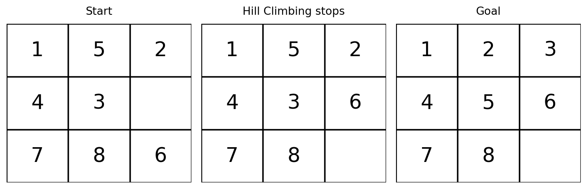
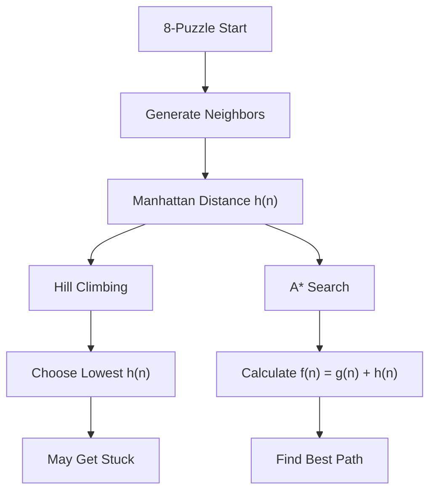
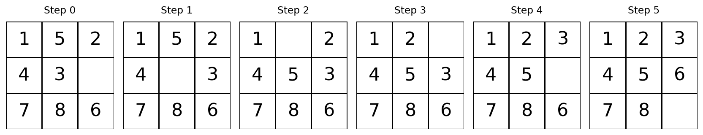

# 🧩 Practical 2 — AI Puzzle Solver using Hill Climbing and A* Search

   

> 🎯 **Core idea:** use the same 8-Puzzle and the same Manhattan Distance heuristic with two different search strategies — Hill Climbing chooses the best neighbour, while A* uses `f(n) = g(n) + h(n)`.

<p align="center"></p>

---

## 📋 Quick Facts

| | |
|---|---|
| 🧩 Problem | Standard 8-Puzzle AI search problem |
| 🎯 Course outcome | CO2 — apply heuristic search techniques |
| 🔎 Algorithms | Hill Climbing and A* Search |
| 🧠 Heuristic | Manhattan Distance |
| 🆚 Comparison | BFS as an uninformed-search baseline |
| 🛠️ Tools | Python + `heapq` |
| ⏱️ Time | About 1 hour |
| ✅ Tested | The complete program was run twice with identical output |

---

## 📑 Contents

1. [What You'll Build](#1️⃣-what-youll-build)
2. [Visual Overview](#2️⃣-visual-overview)
3. [The Problem](#3️⃣-the-problem)
4. [The Heuristic](#4️⃣-the-heuristic--manhattan-distance)
5. [Hill Climbing vs A*](#5️⃣-hill-climbing-vs-a)
6. [Tools](#6️⃣-tools)
7. [Setup](#7️⃣-setup)
8. [Code Walkthrough](#8️⃣-code-walkthrough)
9. [Full Code](#9️⃣-full-code)
10. [Google Colab Version](#🔟-google-colab-version)
11. [Results and Comparison](#1️⃣1️⃣-results-and-comparison)
12. [Try It Yourself](#1️⃣2️⃣-try-it-yourself)
13. [Common Mistakes](#1️⃣3️⃣-common-mistakes)
14. [Quiz](#1️⃣4️⃣-quiz)
15. [Summary](#1️⃣5️⃣-summary)

---

<a id="1️⃣-what-youll-build"></a>
## 1️⃣ What You'll Build

The **8-Puzzle** has eight numbered tiles and one blank space on a `3 × 3` board. A move slides a tile into the blank space. The goal is to reach:

```text
1 2 3
4 5 6
7 8 _
```

You will solve the same puzzle using two heuristic search methods:

| Algorithm | Main decision |
|---|---|
| Hill Climbing | Choose the neighbour with the lowest `h(n)` |
| A* Search | Choose the state with the lowest `f(n) = g(n) + h(n)` |

The same **neighbour generator** and **Manhattan Distance** are used by both algorithms, so the comparison is fair.

---

<a id="2️⃣-visual-overview"></a>
## 2️⃣ Visual Overview



---

<a id="3️⃣-the-problem"></a>
## 3️⃣ The Problem

### Goal State

```python
GOAL = (1, 2, 3,
        4, 5, 6,
        7, 8, 0)
```

`0` represents the blank space.

### Starting State

```python
START = (1, 5, 2,
         4, 3, 0,
         7, 8, 6)
```

The starting state is solvable and is intentionally chosen so that Hill Climbing demonstrates its weakness while A* finds the shortest solution.

---

<a id="4️⃣-the-heuristic--manhattan-distance"></a>
## 4️⃣ The Heuristic — Manhattan Distance

A **heuristic** gives an estimate of how far a state is from the goal.

For the 8-Puzzle, we use **Manhattan Distance**:

$$h(n) = \sum \left(|row_{current}-row_{goal}| + |column_{current}-column_{goal}|\right)$$

For every tile, count the number of row and column moves needed to reach its goal position. The blank is not counted.

For the starting state:

```text
1 5 2
4 3 _
7 8 6
```

The Manhattan Distance is:

```text
h(n) = 5
```

A smaller `h(n)` means the state looks closer to the goal.

---

<a id="5️⃣-hill-climbing-vs-a"></a>
## 5️⃣ Hill Climbing vs A*

### Hill Climbing

Hill Climbing looks only at the current state's neighbours and moves to the one with the lowest heuristic value.

```python
best_state = min(neighbors, key=manhattan_distance)
```

It is simple and usually fast, but it can reach a **local minimum** where no neighbour looks better even though the goal is still reachable.

### A* Search

A* considers both the cost already used and the estimated cost remaining.

$$f(n) = g(n) + h(n)$$

Where:

```text
g(n) = cost from the start
h(n) = estimated cost to the goal
f(n) = total estimated cost
```

A* chooses the state with the smallest `f(n)`.

---

<a id="6️⃣-tools"></a>
## 6️⃣ Tools

| Tool | Purpose |
|---|---|
| `heapq` | Gives A* the state with the lowest `f(n)` |
| Python tuples | Store puzzle states simply and safely |
| `set` | Avoid processing the same state repeatedly |

No external AI library is required. `heapq` is included with Python, so the practical works directly in Google Colab or VS Code.

---

<a id="7️⃣-setup"></a>
## 7️⃣ Setup

### VS Code / Python

No installation is required because the main search code uses Python's standard library.

```python
import heapq
```

### Google Colab

Open a new Colab notebook and run the cells in [Section 10](#🔟-google-colab-version) from top to bottom.

---

<a id="8️⃣-code-walkthrough"></a>
## 8️⃣ Code Walkthrough

### 🔹 Step 1 — Generate Neighbours

The blank tile can move **up, down, left, or right** when the move stays inside the board.

```python
def get_neighbors(state):
    blank = state.index(0)
    row, column = divmod(blank, 3)
    neighbors = []

    for row_change, column_change in [(-1, 0), (1, 0), (0, -1), (0, 1)]:
        new_row = row + row_change
        new_column = column + column_change

        if 0 <= new_row < 3 and 0 <= new_column < 3:
            new_position = new_row * 3 + new_column
            new_state = list(state)
            new_state[blank], new_state[new_position] = new_state[new_position], new_state[blank]
            neighbors.append(tuple(new_state))

    return neighbors
```

### 🔹 Step 2 — Calculate `h(n)`

```python
def manhattan_distance(state):
    distance = 0

    for position, tile in enumerate(state):
        if tile != 0:
            goal_position = tile - 1
            distance += abs(position // 3 - goal_position // 3)
            distance += abs(position % 3 - goal_position % 3)

    return distance
```

### 🔹 Step 3 — Hill Climbing

```python
def hill_climbing(start):
    current_state = start
    path = [current_state]

    while current_state != GOAL:
        best_state = min(
            get_neighbors(current_state),
            key=manhattan_distance
        )

        if manhattan_distance(best_state) >= manhattan_distance(current_state):
            return path, False

        current_state = best_state
        path.append(current_state)

    return path, True
```

The important idea is simply:

```text
Choose the neighbour with the smallest h(n).
```

### 🔹 Step 4 — A* Search

```python
def a_star(start):
    priority_queue = [(manhattan_distance(start), 0, start, [start])]
    best_cost = {start: 0}

    while priority_queue:
        f_cost, path_cost, current_state, path = heapq.heappop(priority_queue)

        if current_state == GOAL:
            return path

        if path_cost != best_cost[current_state]:
            continue

        for neighbor_state in get_neighbors(current_state):
            new_path_cost = path_cost + 1

            if new_path_cost < best_cost.get(neighbor_state, float("inf")):
                best_cost[neighbor_state] = new_path_cost
                new_f_cost = new_path_cost + manhattan_distance(neighbor_state)

                heapq.heappush(
                    priority_queue,
                    (new_f_cost, new_path_cost, neighbor_state, path + [neighbor_state])
                )

    return None
```

The important formula is:

```text
g(n) = cost so far
h(n) = Manhattan Distance
f(n) = g(n) + h(n)
```

---

<a id="9️⃣-full-code"></a>
## 9️⃣ Full Code

```python
import heapq
from collections import deque

GOAL = (1, 2, 3,
        4, 5, 6,
        7, 8, 0)

START = (1, 5, 2,
         4, 3, 0,
         7, 8, 6)


# Generate possible next states

def get_neighbors(state):
    blank = state.index(0)
    row, column = divmod(blank, 3)
    neighbors = []

    for row_change, column_change in [(-1, 0), (1, 0), (0, -1), (0, 1)]:
        new_row = row + row_change
        new_column = column + column_change

        if 0 <= new_row < 3 and 0 <= new_column < 3:
            new_position = new_row * 3 + new_column
            new_state = list(state)
            new_state[blank], new_state[new_position] = new_state[new_position], new_state[blank]
            neighbors.append(tuple(new_state))

    return neighbors


# h(n) = Manhattan Distance

def manhattan_distance(state):
    distance = 0

    for position, tile in enumerate(state):
        if tile != 0:
            goal_position = tile - 1
            distance += abs(position // 3 - goal_position // 3)
            distance += abs(position % 3 - goal_position % 3)

    return distance


# Hill Climbing: choose the lowest h(n)

def hill_climbing(start):
    current_state = start
    path = [current_state]

    while current_state != GOAL:
        best_state = min(
            get_neighbors(current_state),
            key=manhattan_distance
        )

        if manhattan_distance(best_state) >= manhattan_distance(current_state):
            return path, False

        current_state = best_state
        path.append(current_state)

    return path, True


# A*: f(n) = g(n) + h(n)

def a_star(start):
    priority_queue = [(manhattan_distance(start), 0, start, [start])]
    best_cost = {start: 0}
    explored = 0

    while priority_queue:
        f_cost, path_cost, current_state, path = heapq.heappop(priority_queue)
        explored += 1

        if current_state == GOAL:
            return path, explored

        if path_cost != best_cost[current_state]:
            continue

        for neighbor_state in get_neighbors(current_state):
            new_path_cost = path_cost + 1

            if new_path_cost < best_cost.get(neighbor_state, float("inf")):
                best_cost[neighbor_state] = new_path_cost
                new_f_cost = new_path_cost + manhattan_distance(neighbor_state)

                heapq.heappush(
                    priority_queue,
                    (new_f_cost, new_path_cost, neighbor_state, path + [neighbor_state])
                )

    return None, explored


# BFS: uninformed-search comparison

def breadth_first_search(start):
    queue = deque([(start, [start])])
    visited = {start}
    explored = 0

    while queue:
        current_state, path = queue.popleft()
        explored += 1

        if current_state == GOAL:
            return path, explored

        for neighbor_state in get_neighbors(current_state):
            if neighbor_state not in visited:
                visited.add(neighbor_state)
                queue.append((neighbor_state, path + [neighbor_state]))

    return None, explored


# Run both heuristic methods
hill_path, hill_solved = hill_climbing(START)
astar_path, astar_explored = a_star(START)

print("Starting state:", START)
print("h(n):", manhattan_distance(START))

print("\nHill Climbing")
print("Solved:", hill_solved)
print("Steps:", len(hill_path) - 1)

print("\nA* Search")
print("Solved:", astar_path is not None)
print("Steps:", len(astar_path) - 1)
print("States explored:", astar_explored)

# Compare with an uninformed search
bfs_path, bfs_explored = breadth_first_search(START)

print("\nBFS (Uninformed Search)")
print("Solved:", bfs_path is not None)
print("Steps:", len(bfs_path) - 1)
print("States explored:", bfs_explored)
```

---

<a id="🔟-google-colab-version"></a>
## 🔟 Google Colab Version

Run these cells **in order**. The common puzzle and heuristic are written once and then reused by both algorithms.

### 🟦 Cell 1 — Setup

```python
import heapq
from collections import deque

GOAL = (1, 2, 3,
        4, 5, 6,
        7, 8, 0)

START = (1, 5, 2,
         4, 3, 0,
         7, 8, 6)
```

### 🟦 Cell 2 — Neighbours and Heuristic

```python
def get_neighbors(state):
    blank = state.index(0)
    row, column = divmod(blank, 3)
    neighbors = []

    for row_change, column_change in [(-1, 0), (1, 0), (0, -1), (0, 1)]:
        new_row = row + row_change
        new_column = column + column_change

        if 0 <= new_row < 3 and 0 <= new_column < 3:
            new_position = new_row * 3 + new_column
            new_state = list(state)
            new_state[blank], new_state[new_position] = new_state[new_position], new_state[blank]
            neighbors.append(tuple(new_state))

    return neighbors


def manhattan_distance(state):
    distance = 0

    for position, tile in enumerate(state):
        if tile != 0:
            goal_position = tile - 1
            distance += abs(position // 3 - goal_position // 3)
            distance += abs(position % 3 - goal_position % 3)

    return distance


print("Starting state:", START)
print("h(n):", manhattan_distance(START))
```

### 🟦 Cell 3 — Hill Climbing

```python
def hill_climbing(start):
    current_state = start
    path = [current_state]

    while current_state != GOAL:
        best_state = min(
            get_neighbors(current_state),
            key=manhattan_distance
        )

        if manhattan_distance(best_state) >= manhattan_distance(current_state):
            return path, False

        current_state = best_state
        path.append(current_state)

    return path, True
```

### 🟦 Cell 4 — Run Hill Climbing

```python
hill_path, hill_solved = hill_climbing(START)

print("Solved:", hill_solved)
print("Steps:", len(hill_path) - 1)
```

### 🟦 Cell 5 — A* Search

```python
def a_star(start):
    priority_queue = [(manhattan_distance(start), 0, start, [start])]
    best_cost = {start: 0}

    while priority_queue:
        f_cost, path_cost, current_state, path = heapq.heappop(priority_queue)

        if current_state == GOAL:
            return path

        if path_cost != best_cost[current_state]:
            continue

        for neighbor_state in get_neighbors(current_state):
            new_path_cost = path_cost + 1

            if new_path_cost < best_cost.get(neighbor_state, float("inf")):
                best_cost[neighbor_state] = new_path_cost
                new_f_cost = new_path_cost + manhattan_distance(neighbor_state)

                heapq.heappush(
                    priority_queue,
                    (new_f_cost, new_path_cost, neighbor_state, path + [neighbor_state])
                )

    return None
```

### 🟦 Cell 6 — Run A*

```python
astar_path = a_star(START)

print("Solved:", astar_path is not None)
print("Steps:", len(astar_path) - 1)
```

### 🟦 Cell 7 — BFS Comparison

```python
def breadth_first_search(start):
    queue = deque([(start, [start])])
    visited = {start}
    explored = 0

    while queue:
        current_state, path = queue.popleft()
        explored += 1

        if current_state == GOAL:
            return path, explored

        for neighbor_state in get_neighbors(current_state):
            if neighbor_state not in visited:
                visited.add(neighbor_state)
                queue.append((neighbor_state, path + [neighbor_state]))


bfs_path, bfs_explored = breadth_first_search(START)

print("BFS Steps:", len(bfs_path) - 1)
print("BFS States Explored:", bfs_explored)
```

> 💡 **To run only A***, run Cells 1, 2, 5 and 6. To run only Hill Climbing, run Cells 1, 2, 3 and 4.

---

<a id="1️⃣1️⃣-results-and-comparison"></a>
## 1️⃣1️⃣ Results and Comparison

The tested starting state produces:

```text
Starting state: (1, 5, 2, 4, 3, 0, 7, 8, 6)
h(n): 5

Hill Climbing
Solved: False
Steps: 1

A* Search
Solved: True
Steps: 5
States explored: 7

BFS (Uninformed Search)
Solved: True
Steps: 5
States explored: 52
```

### What does this show?

**Hill Climbing** moves closer according to `h(n)`, but after one move it reaches a state where no neighbour looks better. It gets stuck even though the puzzle is still solvable.

**A* uses both the path cost and the heuristic. It finds the shortest 5-move solution and explores only **7 states** in this example.

**BFS** also finds the 5-move solution, but explores **52 states** because it does not use a heuristic.

So the heuristic helps A* focus the search on promising states.

<p align="center"></p>

### Comparison

| Method | Type | Solved | Steps | States Explored |
|---|---|---:|---:|---:|
| Hill Climbing | Informed | ❌ No | 1 | — |
| BFS | Uninformed | ✅ Yes | 5 | 52 |
| A* | Informed | ✅ Yes | 5 | 7 |

> **Important:** the number of explored states depends on the starting puzzle. The purpose of this example is to show the effect of heuristic guidance clearly, not to claim that A* always expands exactly 7 states.

---

<a id="1️⃣2️⃣-try-it-yourself"></a>
## 1️⃣2️⃣ Try It Yourself

1. Change `START` to another solvable puzzle and compare the results.
2. Replace Manhattan Distance with the **misplaced tiles** heuristic and compare A*.
3. Observe cases where Hill Climbing succeeds and cases where it gets stuck.
4. Compare the number of states explored by BFS and A*.

---

<a id="1️⃣3️⃣-common-mistakes"></a>
## ⚠️ Common Mistakes

| Mistake | Correct idea |
|---|---|
| Counting the blank in Manhattan Distance | Do not count `0` |
| Using only `h(n)` in A* | A* uses `f(n) = g(n) + h(n)` |
| Assuming Hill Climbing always finds the goal | It can stop at a local minimum |
| Confusing BFS with heuristic search | BFS is uninformed; it does not use `h(n)` |
| Changing the puzzle between algorithms | Use the same start state for a fair comparison |

---

<a id="1️⃣4️⃣-quiz"></a>
## ❓ Quiz

1. What does `h(n)` represent in the 8-Puzzle?
2. What is the Manhattan Distance heuristic?
3. Why can Hill Climbing get stuck?
4. What is the formula used by A*?
5. What do `g(n)` and `h(n)` represent?
6. Why can A* explore fewer states than BFS?

<details>
<summary>Answers</summary>

1. An estimate of the remaining cost to reach the goal.
2. The total row and column distance of all tiles from their goal positions.
3. It can reach a local minimum where every neighbour looks worse or equal.
4. `f(n) = g(n) + h(n)`.
5. `g(n)` is the cost already travelled; `h(n)` is the estimated remaining cost.
6. A* uses the heuristic to focus on promising states instead of exploring states only by depth.

</details>

---

<a id="1️⃣5️⃣-summary"></a>
## 📝 Summary

```text
8-Puzzle
   ↓
Generate Neighbours
   ↓
Manhattan Distance h(n)
   ↓
 ┌───────────────────────┐
 │                       │
Hill Climbing           A*
│                       │
h(n)                    f(n)=g(n)+h(n)
│                       │
May get stuck           Finds shortest path
```

The main lesson is simple:

> **A heuristic gives the search algorithm useful knowledge about which states are closer to the goal.**

| Concept | Remember |
|---|---|
| `h(n)` | Estimated cost to goal |
| `g(n)` | Cost so far |
| `f(n)` | `g(n) + h(n)` |
| Hill Climbing | Lowest `h(n)` neighbour |
| A* | Lowest `f(n)` state |
| BFS | Uninformed baseline |

## 📂 Files

| File | Purpose |
|---|---|
| `puzzle_solver.py` | Complete Python implementation |
| `images/01_hill_climbing_result.png` | Hill Climbing start, stuck state, and goal |
| `images/02_astar_solution_path.png` | A* solution path step by step |

⬅️ **Previous:** Practical 1 · ➡️ **Next:** Practical 3
