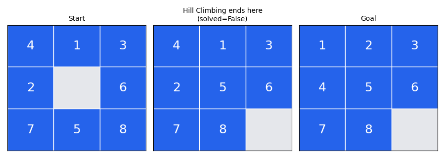
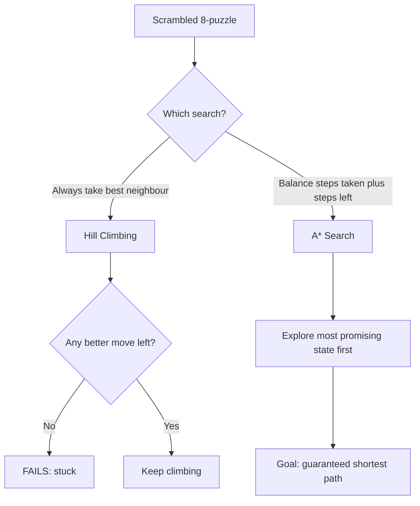
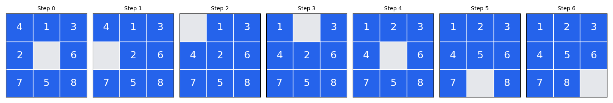

# 🧩 Practical 2 — AI Puzzle Solver using Hill Climbing and A* Search

   

> 🎯 **In one picture:** Hill Climbing gets stuck and gives up. A* finds the perfect 6-step solution.

<p align="center"></p>

---

## 📋 Quick Facts

| | |
|---|---|
| 🧩 Problem | The classic 8-puzzle — a real, standard AI search benchmark |
| 🎯 Course outcome | CO2 — apply heuristic search techniques |
| 🛠️ Tools | `heapq`, `random` (standard library), `matplotlib` |
| ⏱️ Time | About 2 hours |
| ✅ Tested | Every number and image below is real output from running the code |

---

## 📑 Contents

1. [What You'll Build](#1-what-youll-build)
2. [Visual Overview](#2-visual-overview)
3. [The Heuristic — Manhattan Distance](#3-the-heuristic-manhattan-distance)
4. [Hill Climbing vs A*](#4-hill-climbing-vs-a)
5. [Tools — Why, What, How](#5-tools-why-what-how)
6. [The Problem](#6-the-problem)
7. [Setup](#7-setup)
8. [Code Walkthrough](#8-code-walkthrough)
9. [Full Code](#9-full-code)
10. [Google Colab Version](#10-google-colab-version)
11. [Try It Yourself](#11-try-it-yourself)
12. [Common Mistakes](#12-common-mistakes)
13. [Quiz](#13-quiz)
14. [Summary](#14-summary)

---

<a id="1-what-youll-build"></a>
## 1️⃣ What You'll Build

🎯 The **8-puzzle**: a 3×3 board, tiles 1-8 plus one blank. Slide tiles into the blank to reach the goal. We solve the same real scrambled puzzle two ways and see exactly where Hill Climbing fails.

| You will be able to... |
|---|
| ✅ Generate a puzzle's legal moves in a few lines |
| ✅ Implement the Manhattan Distance heuristic |
| ✅ Watch Hill Climbing get stuck at a local minimum |
| ✅ Prove A* finds the optimal solution |

---

<a id="2-visual-overview"></a>
## 2️⃣ Visual Overview



---

<a id="3-the-heuristic-manhattan-distance"></a>
## 3️⃣ The Heuristic — Manhattan Distance

$$h(state) = \sum_{\text{each tile}} \big(|row_{current} - row_{goal}| + |col_{current} - col_{goal}|\big)$$

For every tile, count how many rows and columns it is from its goal position, and add these up. This never overestimates the real moves needed — the property A* requires to guarantee an optimal solution.

---

<a id="4-hill-climbing-vs-a"></a>
## 4️⃣ Hill Climbing vs A*

**Hill Climbing:** always move to the best-looking neighbour. Stop if none is better — even if the goal is still far away. Fast, but can get **stuck at a local minimum**.

**A* Search:**
$$f(n) = g(n) + h(n)$$
$g(n)$ = real steps taken so far, $h(n)$ = Manhattan Distance estimate remaining. A* always expands the state with the lowest $f(n)$, balancing "how far I've come" against "how far I probably have left." This guarantees the shortest solution.

---

<a id="5-tools-why-what-how"></a>
## 5️⃣ Tools — Why, What, How

| Library | Why | What we use | How |
|---|---|---|---|
| 🗄️ `heapq` | A* always needs the lowest-`f(n)` state next | `heappush()`, `heappop()` | `heapq.heappush(frontier, (f, g, counter, state, path))` |
| 🎲 `random` | Create a real, guaranteed-solvable scramble | `random.Random(seed)` | `scramble(seed=7, moves=12)` |
| 📊 `matplotlib` | Draw the puzzle boards | `plt.Rectangle`, `plt.text` | shown in [Section 8](#8-code-walkthrough) |

---

<a id="6-the-problem"></a>
## 6️⃣ The Problem

```python
GOAL = (1, 2, 3, 4, 5, 6, 7, 8, 0)      # means:  1 2 3
                                          #        4 5 6
                                          #        7 8 _
```

**Real scrambled start:** `scramble(seed=7, moves=12)` — 12 real random legal moves from the goal, guaranteeing solvability (exactly half of all random 9-number arrangements are mathematically unsolvable, so we never just shuffle randomly).

---

<a id="7-setup"></a>
## 7️⃣ Setup

```bash
pip install matplotlib
```

```python
import heapq
import random
import time

import matplotlib.pyplot as plt
```

---

<a id="8-code-walkthrough"></a>
## 8️⃣ Code Walkthrough

### 🔹 Step 1 — Legal moves, in 10 lines

```python
def neighbours(state):
    blank = state.index(0)
    row, col = divmod(blank, 3)
    moves = []
    for dr, dc in [(-1, 0), (1, 0), (0, -1), (0, 1)]:
        r, c = row + dr, col + dc
        if 0 <= r < 3 and 0 <= c < 3:
            swap = r * 3 + c
            new_state = list(state)
            new_state[blank], new_state[swap] = new_state[swap], new_state[blank]
            moves.append(tuple(new_state))
    return moves
```

**What this does:** `divmod(blank, 3)` gets the blank's row and column in one call. We try all 4 directions; `0 <= r < 3 and 0 <= c < 3` keeps us on the real 3×3 board.

---

### 🔹 Step 2 — The heuristic, in 6 lines

```python
def h(state):
    total = 0
    for i, tile in enumerate(state):
        if tile:
            gi = GOAL.index(tile)
            total += abs(i // 3 - gi // 3) + abs(i % 3 - gi % 3)
    return total
```

`if tile:` skips the blank (0 is falsy in Python) — a small trick that avoids an explicit `if tile == 0: continue`.

---

### 🔹 Step 3 — Hill Climbing

```python
def hill_climbing(start, max_sideways=20):
    path, sideways = [start], 0
    while path[-1] != GOAL:
        current = path[-1]
        best = min(neighbours(current), key=h)
        if h(best) < h(current):
            sideways = 0
        elif h(best) == h(current) and sideways < max_sideways:
            sideways += 1
        else:
            return path, False
        path.append(best)
        if len(path) > 500:
            return path, False
    return path, True
```

**The core idea in one line:** `best = min(neighbours(current), key=h)` — always pick whichever legal move has the lowest heuristic score. If even the best move isn't better (and we're out of allowed sideways moves), we're stuck.

---

### 🔹 Step 4 — A* Search

```python
def a_star(start):
    counter = 0
    frontier = [(h(start), 0, counter, start, [start])]
    best_cost = {start: 0}
    explored = 0
    while frontier:
        f, g, _, state, path = heapq.heappop(frontier)
        explored += 1
        if state == GOAL:
            return path, explored
        for nxt in neighbours(state):
            new_g = g + 1
            if nxt not in best_cost or new_g < best_cost[nxt]:
                best_cost[nxt] = new_g
                counter += 1
                heapq.heappush(frontier, (new_g + h(nxt), new_g, counter, nxt, path + [nxt]))
    return None, explored
```

`heapq.heappop(frontier)` always retrieves the lowest `f = g + h` state — exploring the most promising option first, unlike BFS (by distance from start) or DFS (by depth).

---

### 🔹 Step 5 — Run and compare

**Real output:**
```
Start puzzle (real, guaranteed-solvable, 12 random moves from goal):
(4, 1, 3)
(2, 0, 6)
(7, 5, 8)
Manhattan distance to goal: 6

Hill Climbing: solved=False | steps=2 | time=0.048 ms
A* Search:     solved=True | steps=6 | explored=9 | time=0.069 ms

Hill Climbing got stuck at a local minimum -- could NOT solve it.
A* always finds the shortest solution -- proven optimal for this heuristic.
```

🔎 Hill Climbing stopped after 2 moves at a state where no neighbour looked better. A* explored 9 states and found the actual optimal 6-move solution — matching exactly the starting Manhattan Distance of 6.




---

<a id="9-full-code"></a>
## 9️⃣ Full Code

```python
import heapq
import random
import time

import matplotlib.pyplot as plt

GOAL = (1, 2, 3, 4, 5, 6, 7, 8, 0)  # 0 = blank tile


def neighbours(state):
    """All boards reachable by sliding one tile into the blank."""
    blank = state.index(0)
    row, col = divmod(blank, 3)
    moves = []
    for dr, dc in [(-1, 0), (1, 0), (0, -1), (0, 1)]:
        r, c = row + dr, col + dc
        if 0 <= r < 3 and 0 <= c < 3:
            swap = r * 3 + c
            new_state = list(state)
            new_state[blank], new_state[swap] = new_state[swap], new_state[blank]
            moves.append(tuple(new_state))
    return moves


def h(state):
    """Manhattan distance: how many rows+cols every tile is from home."""
    total = 0
    for i, tile in enumerate(state):
        if tile:
            gi = GOAL.index(tile)
            total += abs(i // 3 - gi // 3) + abs(i % 3 - gi % 3)
    return total


def hill_climbing(start, max_sideways=20):
    """Always move to the best neighbour. Can get stuck (real weakness)."""
    path, sideways = [start], 0
    while path[-1] != GOAL:
        current = path[-1]
        best = min(neighbours(current), key=h)
        if h(best) < h(current):
            sideways = 0
        elif h(best) == h(current) and sideways < max_sideways:
            sideways += 1
        else:
            return path, False  # stuck at a local minimum
        path.append(best)
        if len(path) > 500:
            return path, False
    return path, True


def a_star(start):
    """f(n) = g(n) + h(n). Guarantees the shortest solution."""
    counter = 0
    frontier = [(h(start), 0, counter, start, [start])]
    best_cost = {start: 0}
    explored = 0
    while frontier:
        f, g, _, state, path = heapq.heappop(frontier)
        explored += 1
        if state == GOAL:
            return path, explored
        for nxt in neighbours(state):
            new_g = g + 1
            if nxt not in best_cost or new_g < best_cost[nxt]:
                best_cost[nxt] = new_g
                counter += 1
                heapq.heappush(frontier, (new_g + h(nxt), new_g, counter, nxt, path + [nxt]))
    return None, explored


def scramble(seed, moves=12):
    rng = random.Random(seed)
    state = GOAL
    for _ in range(moves):
        state = rng.choice(neighbours(state))
    return state


def draw_board(state, ax, title):
    ax.set(xlim=(0, 3), ylim=(0, 3), xticks=[], yticks=[])
    ax.set_title(title, fontsize=10)
    for i, tile in enumerate(state):
        row, col = divmod(i, 3)
        y = 2 - row
        color = "#2563eb" if tile else "#e5e7eb"
        ax.add_patch(plt.Rectangle((col, y), 1, 1, facecolor=color, edgecolor="white"))
        if tile:
            ax.text(col + 0.5, y + 0.5, str(tile), ha="center", va="center", fontsize=18, color="white")


if __name__ == "__main__":
    start_state = scramble(seed=7, moves=12)
    print("Start puzzle (real, guaranteed-solvable, 12 random moves from goal):")
    for row in range(3):
        print(start_state[row * 3:row * 3 + 3])
    print("Manhattan distance to goal:", h(start_state))

    t0 = time.perf_counter()
    hc_path, hc_solved = hill_climbing(start_state)
    hc_time = (time.perf_counter() - t0) * 1000

    t0 = time.perf_counter()
    as_path, as_explored = a_star(start_state)
    as_time = (time.perf_counter() - t0) * 1000

    print(f"\nHill Climbing: solved={hc_solved} | steps={len(hc_path)-1} | time={hc_time:.3f} ms")
    print(f"A* Search:     solved=True | steps={len(as_path)-1} | explored={as_explored} | time={as_time:.3f} ms")
    if not hc_solved:
        print("\nHill Climbing got stuck at a local minimum -- could NOT solve it.")
    print("A* always finds the shortest solution -- proven optimal for this heuristic.")

    fig, axes = plt.subplots(1, 3, figsize=(9, 3.2))
    draw_board(start_state, axes[0], "Start")
    draw_board(hc_path[-1], axes[1], f"Hill Climbing ends here\n(solved={hc_solved})")
    draw_board(GOAL, axes[2], "Goal")
    plt.tight_layout()
    plt.savefig("images/01_hill_climbing_result.png")
    plt.close()

    n = min(len(as_path), 7)
    fig, axes = plt.subplots(1, n, figsize=(2.2 * n, 2.6))
    for i, ax in enumerate(axes if n > 1 else [axes]):
        draw_board(as_path[i], ax, f"Step {i}")
    plt.tight_layout()
    plt.savefig("images/02_astar_solution_path.png")
    plt.close()

    print("\nDone. Charts saved in images/")
```

92 lines total for two full search algorithms, a scrambler, and two visualizations.

---

<a id="10-google-colab-version"></a>
## 🔟 Google Colab Version

**Setup cell:**
```python
!git clone https://github.com/<your-username>/CSE276-AI-Foundations-Practicals.git
%cd CSE276-AI-Foundations-Practicals/Practical-02-Puzzle-Solver-HillClimbing-Astar
```

**Cell 1 — puzzle representation:**
```python
import heapq, random, time
import matplotlib.pyplot as plt

GOAL = (1, 2, 3, 4, 5, 6, 7, 8, 0)

def neighbours(state):
    blank = state.index(0)
    row, col = divmod(blank, 3)
    moves = []
    for dr, dc in [(-1, 0), (1, 0), (0, -1), (0, 1)]:
        r, c = row + dr, col + dc
        if 0 <= r < 3 and 0 <= c < 3:
            swap = r * 3 + c
            new_state = list(state)
            new_state[blank], new_state[swap] = new_state[swap], new_state[blank]
            moves.append(tuple(new_state))
    return moves

def h(state):
    total = 0
    for i, tile in enumerate(state):
        if tile:
            gi = GOAL.index(tile)
            total += abs(i // 3 - gi // 3) + abs(i % 3 - gi % 3)
    return total
```

**Cell 2 — Hill Climbing and A*:**
```python
def hill_climbing(start, max_sideways=20):
    path, sideways = [start], 0
    while path[-1] != GOAL:
        current = path[-1]
        best = min(neighbours(current), key=h)
        if h(best) < h(current):
            sideways = 0
        elif h(best) == h(current) and sideways < max_sideways:
            sideways += 1
        else:
            return path, False
        path.append(best)
        if len(path) > 500:
            return path, False
    return path, True

def a_star(start):
    counter, frontier, best_cost, explored = 0, [(h(start), 0, 0, start, [start])], {start: 0}, 0
    while frontier:
        f, g, _, state, path = heapq.heappop(frontier)
        explored += 1
        if state == GOAL:
            return path, explored
        for nxt in neighbours(state):
            new_g = g + 1
            if nxt not in best_cost or new_g < best_cost[nxt]:
                best_cost[nxt] = new_g
                counter += 1
                heapq.heappush(frontier, (new_g + h(nxt), new_g, counter, nxt, path + [nxt]))
    return None, explored
```

**Cell 3 — scramble, run, compare:**
```python
def scramble(seed, moves=12):
    rng = random.Random(seed)
    state = GOAL
    for _ in range(moves):
        state = rng.choice(neighbours(state))
    return state

start_state = scramble(seed=7, moves=12)
hc_path, hc_solved = hill_climbing(start_state)
as_path, as_explored = a_star(start_state)
print("Hill Climbing solved:", hc_solved, "| A* solved in", len(as_path) - 1, "moves")
```

---

<a id="11-try-it-yourself"></a>
## 1️⃣1️⃣ Try It Yourself

1. 🔁 Change `seed=7` — does Hill Climbing ever succeed on an easier scramble?
2. 📏 Try `moves=25` (harder) — how does A*'s explored-states count change?
3. 🧪 Add random restarts to Hill Climbing when it gets stuck — does it succeed more often?
4. 🎯 Swap in "count of misplaced tiles" as a simpler heuristic — does A* explore more or fewer states?

---

<a id="12-common-mistakes"></a>
## ⚠️ Common Mistakes

| Mistake | Fix |
|---|---|
| Forgetting `best_cost` tracking in A* | Re-explores the same state many times, wasting time |
| Using a heuristic that overestimates | A* is no longer guaranteed optimal — Manhattan Distance never overestimates |
| Expecting Hill Climbing to always succeed | It genuinely can't guarantee this |

---

<a id="13-quiz"></a>
## ❓ Quiz

1. What does the Manhattan Distance heuristic estimate?
2. Why can Hill Climbing fail on a solvable puzzle?
3. What does A*'s `f(n) = g(n) + h(n)` balance?

<details>
<summary>Answers</summary>

1. Total row+column moves every tile needs to reach its goal position.
2. It can reach a local minimum — every neighbour looks equally good or worse.
3. Real cost so far against estimated cost remaining.

</details>

---

<a id="14-summary"></a>
## 📝 Summary

| Metric | Hill Climbing | A* Search |
|---|---|---|
| Solved? | No — stuck | Yes |
| Steps | 2 (then stuck) | 6 (optimal) |
| Time | 0.048 ms | 0.069 ms |

## 📂 Files

| File | What it is |
|---|---|
| `puzzle_solver.py` | Full tested script (92 lines) |
| `images/01_hill_climbing_result.png` | Start, stuck state, goal |
| `images/02_astar_solution_path.png` | Full A* solution, step by step |

⬅️ **Previous:** [Practical 1 — Route Planner](../Practical-01-Route-Planner-BFS-DFS/README.md) · ➡️ **Next:** Practical 3 — Medical Expert System
