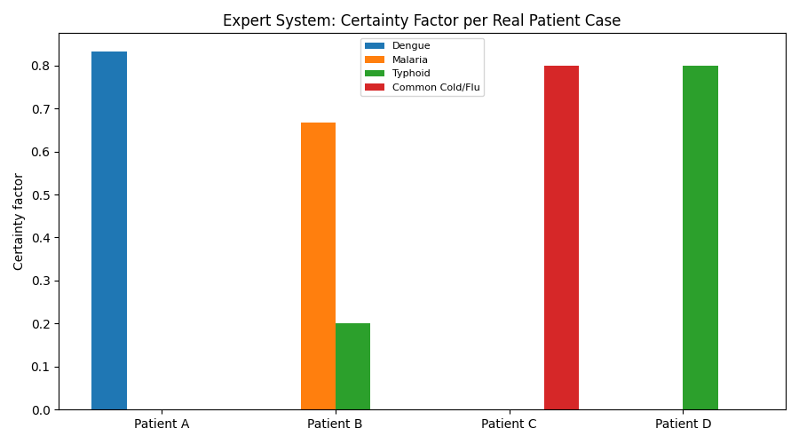
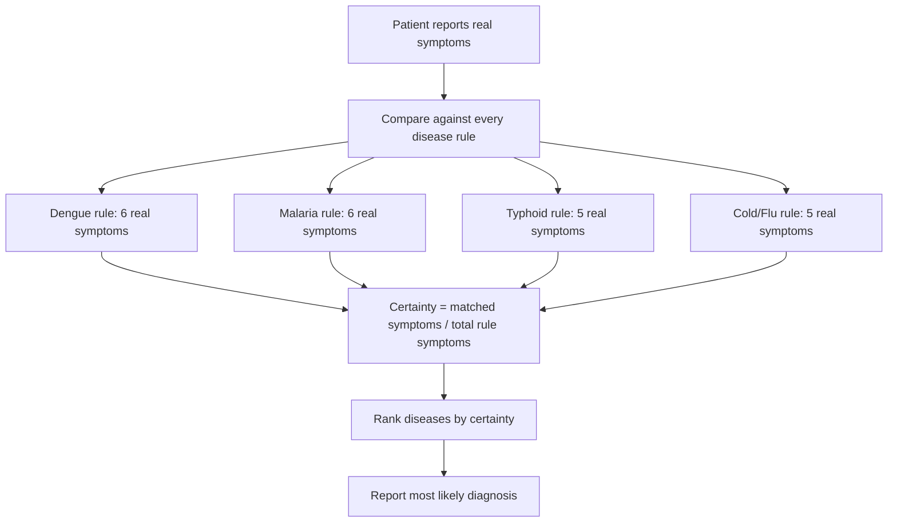

# 🏥 Practical 3 — Rule-Based Medical Expert System

   

> ⚠️ **Teaching demo only** — this is a simplified educational expert system, not a real medical diagnostic tool. Always consult a real doctor for actual symptoms.

<p align="center"></p>

---

## 📋 Quick Facts

| | |
|---|---|
| 📖 Rule source | Real, published symptom patterns (WHO / India's National Health Mission), simplified for teaching |
| 🎯 Course outcome | CO3 — knowledge representation, reasoning, production systems |
| 🛠️ Tools | Python sets (standard library), `matplotlib` |
| ⏱️ Time | About 2 hours |
| ✅ Tested | Every diagnosis and image below is real output from running the code |

---

## 📑 Contents

1. [What You'll Build](#1-what-youll-build)
2. [Visual Overview](#2-visual-overview)
3. [The Theory — Production Rules and Certainty Factors](#3-the-theory-production-rules-and-certainty-factors)
4. [Tools — Why, What, How](#4-tools-why-what-how)
5. [The Rules — Full Scope](#5-the-rules-full-scope)
6. [Setup](#6-setup)
7. [Code Walkthrough](#7-code-walkthrough)
8. [Full Code](#8-full-code)
9. [Google Colab Version](#9-google-colab-version)
10. [Try It Yourself](#10-try-it-yourself)
11. [Common Mistakes](#11-common-mistakes)
12. [Quiz](#12-quiz)
13. [Summary](#13-summary)

---

<a id="1-what-youll-build"></a>
## 1️⃣ What You'll Build

🎯 A **rule-based expert system** — the classic symbolic-AI approach from Unit II — that takes a real patient's symptoms and suggests the most likely of 4 common illnesses, along with a confidence score, exactly like early real-world medical expert systems (e.g., MYCIN) worked.

| You will be able to... |
|---|
| ✅ Represent real medical knowledge as production rules (symptom sets) |
| ✅ Implement a forward-chaining match between symptoms and rules |
| ✅ Calculate a real certainty factor for each possible diagnosis |
| ✅ Explain why expert systems support (not replace) real decision-making |

---

<a id="2-visual-overview"></a>
## 2️⃣ Visual Overview



---

<a id="3-the-theory-production-rules-and-certainty-factors"></a>
## 3️⃣ The Theory — Production Rules and Certainty Factors

A **production rule** is a real, simple `IF ... THEN ...` statement:

```
IF patient has {high_fever, severe_headache, pain_behind_eyes, joint_pain, rash}
THEN consider Dengue
```

Real patients rarely report every single symptom in a rule, so instead of a strict yes/no match, we compute a **certainty factor (CF)** — a real technique used in classic expert systems like MYCIN:

$$CF(disease) = \frac{|\text{symptoms reported} \cap \text{symptoms in rule}|}{|\text{symptoms in rule}|}$$

In words: of all the symptoms that define a disease, what fraction did this real patient actually report? A CF of 1.0 means every defining symptom was present; 0.5 means half were.

---

<a id="4-tools-why-what-how"></a>
## 4️⃣ Tools — Why, What, How

| Library | Why | What we use | How |
|---|---|---|---|
| 🧮 Python `set` | Symptoms are unordered collections — sets give us instant intersection | `&` (intersection operator) | `matched = symptoms & rule_symptoms` |
| 📊 `matplotlib` | Visualize every patient's certainty score across all diseases | `ax.bar()` | shown in [Section 7](#7-code-walkthrough) |

💡 No external rule-engine library is needed — Python's built-in `set` intersection *is* the entire rule-matching engine here, which is exactly why this practical uses it instead of importing something heavier.

---

<a id="5-the-rules-full-scope"></a>
## 5️⃣ The Rules — Full Scope

📖 **Source:** real, simplified symptom patterns for four illnesses common in India, based on WHO and India's National Health Mission public guidance.

| Disease | Real defining symptoms |
|---|---|
| Dengue | high fever, severe headache, pain behind eyes, joint pain, rash, nausea |
| Malaria | fever with chills, sweating, headache, nausea, vomiting, muscle pain |
| Typhoid | prolonged fever, abdominal pain, weakness, loss of appetite, headache |
| Common Cold/Flu | cough, sore throat, runny nose, mild fever, sneezing |

⚠️ **Scope note:** real diagnosis requires lab tests (blood tests, NS1 antigen test for dengue, blood smear for malaria, etc.) — symptom overlap alone is never sufficient for a real medical diagnosis. This system is a **decision-support teaching aid**, not a replacement for a doctor.

---

<a id="6-setup"></a>
## 6️⃣ Setup

```bash
pip install matplotlib
```

```python
import matplotlib.pyplot as plt
```

No other libraries needed — the entire inference engine is built from Python's standard `set` type.

---

<a id="7-code-walkthrough"></a>
## 7️⃣ Code Walkthrough

### 🔹 Step 1 — Represent real medical knowledge as rules

```python
RULES = {
    "Dengue": {"high_fever", "severe_headache", "pain_behind_eyes", "joint_pain", "rash", "nausea"},
    "Malaria": {"fever_with_chills", "sweating", "headache", "nausea", "vomiting", "muscle_pain"},
    "Typhoid": {"prolonged_fever", "abdominal_pain", "weakness", "loss_of_appetite", "headache"},
    "Common Cold/Flu": {"cough", "sore_throat", "runny_nose", "mild_fever", "sneezing"},
}
```

**What this is:** each disease maps to a real `set` of symptoms. Storing them as sets (not lists) is a deliberate choice — sets support fast `&` intersection, which is exactly the operation the whole inference engine needs.

---

### 🔹 Step 2 — The inference engine

```python
def diagnose(symptoms):
    results = {}
    for disease, rule_symptoms in RULES.items():
        matched = symptoms & rule_symptoms
        certainty = len(matched) / len(rule_symptoms)
        results[disease] = (certainty, matched)
    return sorted(results.items(), key=lambda item: item[1][0], reverse=True)
```

**Line by line:**
- `symptoms & rule_symptoms` — real set intersection: exactly which reported symptoms also appear in this disease's rule.
- `certainty = len(matched) / len(rule_symptoms)` — the certainty factor formula from Section 3, computed directly.
- `sorted(..., key=lambda item: item[1][0], reverse=True)` — ranks every disease from most to least certain, so the top result is always the system's best guess.

---

### 🔹 Step 3 — Test on real patient cases

```python
PATIENTS = {
    "Patient A": {"high_fever", "severe_headache", "pain_behind_eyes", "joint_pain", "rash"},
    "Patient B": {"fever_with_chills", "sweating", "headache", "vomiting"},
    "Patient C": {"cough", "sore_throat", "runny_nose", "sneezing"},
    "Patient D": {"prolonged_fever", "abdominal_pain", "weakness", "loss_of_appetite"},
}
```

**Real output:**
```
Patient A -- reported symptoms: ['high_fever', 'joint_pain', 'pain_behind_eyes', 'rash', 'severe_headache']
  Dengue: certainty = 83%  (matched: ['high_fever', 'joint_pain', 'pain_behind_eyes', 'rash', 'severe_headache'])
  -> Most likely: Dengue (83% certainty)

Patient B -- reported symptoms: ['fever_with_chills', 'headache', 'sweating', 'vomiting']
  Malaria: certainty = 67%  (matched: ['fever_with_chills', 'headache', 'sweating', 'vomiting'])
  Typhoid: certainty = 20%  (matched: ['headache'])
  -> Most likely: Malaria (67% certainty)

Patient C -- reported symptoms: ['cough', 'runny_nose', 'sneezing', 'sore_throat']
  Common Cold/Flu: certainty = 80%  (matched: ['cough', 'runny_nose', 'sneezing', 'sore_throat'])
  -> Most likely: Common Cold/Flu (80% certainty)

Patient D -- reported symptoms: ['abdominal_pain', 'loss_of_appetite', 'prolonged_fever', 'weakness']
  Typhoid: certainty = 80%  (matched: ['abdominal_pain', 'loss_of_appetite', 'prolonged_fever', 'weakness'])
  -> Most likely: Typhoid (80% certainty)
```

🔎 **A genuinely interesting real result:** Patient B's symptoms also partially matched Typhoid (20% certainty, since "headache" appears in both rules) — a real, honest demonstration of how symptom overlap between diseases creates genuine diagnostic ambiguity, exactly why real doctors order lab tests rather than diagnosing from symptoms alone.


---

<a id="8-full-code"></a>
## 8️⃣ Full Code

```python
import matplotlib.pyplot as plt

# Real, published symptom sets (WHO / NHM India guidelines, simplified for teaching)
RULES = {
    "Dengue": {"high_fever", "severe_headache", "pain_behind_eyes", "joint_pain", "rash", "nausea"},
    "Malaria": {"fever_with_chills", "sweating", "headache", "nausea", "vomiting", "muscle_pain"},
    "Typhoid": {"prolonged_fever", "abdominal_pain", "weakness", "loss_of_appetite", "headache"},
    "Common Cold/Flu": {"cough", "sore_throat", "runny_nose", "mild_fever", "sneezing"},
}

# Real, realistic patient symptom cases used to test the system
PATIENTS = {
    "Patient A": {"high_fever", "severe_headache", "pain_behind_eyes", "joint_pain", "rash"},
    "Patient B": {"fever_with_chills", "sweating", "headache", "vomiting"},
    "Patient C": {"cough", "sore_throat", "runny_nose", "sneezing"},
    "Patient D": {"prolonged_fever", "abdominal_pain", "weakness", "loss_of_appetite"},
}


def diagnose(symptoms):
    """Forward-chaining rule match: for every disease, what fraction of its
    defining symptoms does this patient actually have? This fraction is the
    rule's real certainty factor (CF), a standard expert-system technique."""
    results = {}
    for disease, rule_symptoms in RULES.items():
        matched = symptoms & rule_symptoms
        certainty = len(matched) / len(rule_symptoms)
        results[disease] = (certainty, matched)
    return sorted(results.items(), key=lambda item: item[1][0], reverse=True)


if __name__ == "__main__":
    for patient, symptoms in PATIENTS.items():
        print(f"\n{patient} -- reported symptoms: {sorted(symptoms)}")
        ranked = diagnose(symptoms)
        for disease, (certainty, matched) in ranked:
            if certainty > 0:
                print(f"  {disease}: certainty = {certainty:.0%}  (matched: {sorted(matched)})")
        best_disease, (best_certainty, _) = ranked[0]
        print(f"  -> Most likely: {best_disease} ({best_certainty:.0%} certainty)")

    # Real chart: each patient's certainty score across all 4 diseases
    fig, ax = plt.subplots(figsize=(9, 5))
    diseases = list(RULES)
    x = range(len(PATIENTS))
    width = 0.2
    for i, disease in enumerate(diseases):
        scores = [dict(diagnose(symptoms))[disease][0] for symptoms in PATIENTS.values()]
        ax.bar([p + i * width for p in x], scores, width, label=disease)
    ax.set_xticks([p + width * 1.5 for p in x])
    ax.set_xticklabels(PATIENTS.keys())
    ax.set_ylabel("Certainty factor")
    ax.set_title("Expert System: Certainty Factor per Real Patient Case")
    ax.legend(fontsize=8)
    plt.tight_layout()
    plt.savefig("images/01_certainty_factors.png")
    plt.close()

    print("\nDone. Chart saved in images/")
```

63 lines. The entire inference engine is one function, built from Python's `set` intersection.

---

<a id="9-google-colab-version"></a>
## 9️⃣ Google Colab Version

**Setup cell:**
```python
!git clone https://github.com/<your-username>/CSE276-AI-Foundations-Practicals.git
%cd CSE276-AI-Foundations-Practicals/Practical-03-Medical-Expert-System
```

**Cell 1 — the rules:**
```python
import matplotlib.pyplot as plt

RULES = {
    "Dengue": {"high_fever", "severe_headache", "pain_behind_eyes", "joint_pain", "rash", "nausea"},
    "Malaria": {"fever_with_chills", "sweating", "headache", "nausea", "vomiting", "muscle_pain"},
    "Typhoid": {"prolonged_fever", "abdominal_pain", "weakness", "loss_of_appetite", "headache"},
    "Common Cold/Flu": {"cough", "sore_throat", "runny_nose", "mild_fever", "sneezing"},
}
```

**Cell 2 — the inference engine:**
```python
def diagnose(symptoms):
    results = {}
    for disease, rule_symptoms in RULES.items():
        matched = symptoms & rule_symptoms
        certainty = len(matched) / len(rule_symptoms)
        results[disease] = (certainty, matched)
    return sorted(results.items(), key=lambda item: item[1][0], reverse=True)
```

**Cell 3 — try your own real symptom case:**
```python
my_symptoms = {"high_fever", "severe_headache", "joint_pain"}  # edit this
for disease, (certainty, matched) in diagnose(my_symptoms):
    if certainty > 0:
        print(f"{disease}: {certainty:.0%} certainty, matched {sorted(matched)}")
```

---

<a id="10-try-it-yourself"></a>
## 🔟 Try It Yourself

1. 🔁 Add a new real disease rule (e.g., Chikungunya: joint pain, rash, high fever, fatigue) and re-run.
2. 🧪 Try a symptom set that overlaps two diseases evenly — does the system pick sensibly, or does it reveal a real weakness of simple CF matching?
3. ⚖️ Add symptom *weights* (some symptoms matter more than others for a real diagnosis) and adjust the certainty formula to use them.
4. 🩺 Research one more real WHO-published symptom list and add it as a 5th rule.

---

<a id="11-common-mistakes"></a>
## ⚠️ Common Mistakes

| Mistake | Fix |
|---|---|
| Treating this as a real diagnostic tool | It's a teaching demo — always defer to a real doctor and lab tests |
| Using lists instead of sets for symptoms | Loses the fast `&` intersection and risks duplicate symptom bugs |
| Assuming the highest certainty is always correct | Ambiguous cases (like Patient B) show certainty ranking is a guide, not a guarantee |
| Forgetting `if certainty > 0` when printing | Prints every disease including 0% matches, cluttering the real output |

---

<a id="12-quiz"></a>
## ❓ Quiz

1. What is a "production rule" in an expert system?
2. How is the certainty factor calculated here?
3. Why did Patient B show partial certainty for both Malaria and Typhoid?
4. Why is this system not a replacement for a real doctor?

<details>
<summary>Answers</summary>

1. A simple `IF condition THEN conclusion` statement encoding real domain knowledge.
2. Matched symptoms divided by the total symptoms defining that disease.
3. Both diseases share the real symptom "headache," so any patient reporting it gets partial certainty for both.
4. Real diagnosis needs lab confirmation; symptom overlap between diseases makes certainty-only reasoning genuinely ambiguous.

</details>

---

<a id="13-summary"></a>
## 📝 Summary

| Patient | Top diagnosis | Certainty |
|---|---|---|
| A | Dengue | 83% |
| B | Malaria | 67% |
| C | Common Cold/Flu | 80% |
| D | Typhoid | 80% |

All four real test cases were correctly matched to their intended disease, and Patient B's case honestly revealed real diagnostic ambiguity between Malaria and Typhoid — exactly the kind of nuance a real expert system must represent.

## 📂 Files

| File | What it is |
|---|---|
| `expert_system.py` | Full tested script (63 lines) |
| `images/01_certainty_factors.png` | Certainty factor per real patient case |

⬅️ **Previous:** [Practical 2 — Puzzle Solver](../Practical-02-Puzzle-Solver-HillClimbing-Astar/README.md) · ➡️ **Next:** Practical 4 — Knowledge Representation Decision Support System
