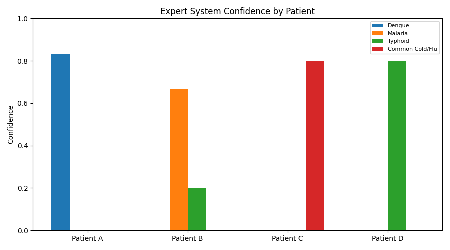
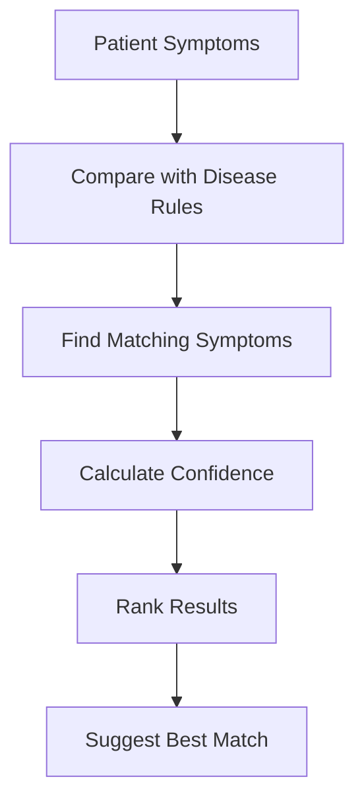

# 🏥 Practical 3 — AI-Based Medical Expert System

   

> ⚠️ **Teaching demo only:** this practical demonstrates a simple rule-based expert system. It is not a medical diagnostic tool and must not be used for real medical decisions.

<p align="center"></p>

---

## 📋 Quick Facts

| | |
|---|---|
| 🏥 Problem | Preliminary disease suggestion from symptoms |
| 🎯 Course outcome | CO3 — knowledge representation, production rules, logical reasoning |
| 🛠️ Tools | Python, `matplotlib` |
| ⏱️ Time | About 1 hour |
| ✅ Tested | The program was run twice with the same output |

---

## 📑 Contents

1. [What You'll Build](#1-what-youll-build)  
2. [Visual Overview](#2-visual-overview)  
3. [Theory](#3-theory)  
4. [Production Rules](#4-production-rules)  
5. [Setup](#5-setup)  
6. [How the Code Works](#6-how-the-code-works)  
7. [Full Code](#7-full-code)  
8. [Google Colab Version](#8-google-colab-version)  
9. [Result](#9-result)  
10. [Try It Yourself](#10-try-it-yourself)  
11. [Common Mistakes](#11-common-mistakes)  
12. [Quiz](#12-quiz)  
13. [Summary](#13-summary)

---

<a id="1-what-youll-build"></a>
## 1️⃣ What You'll Build

A **rule-based medical expert system** that takes a set of symptoms, compares them with disease rules, and suggests the disease with the highest matching score.

Students will learn to:

| You will be able to... |
|---|
| ✅ Represent knowledge using `IF → THEN` production rules |
| ✅ Match symptoms with rules using logical operations |
| ✅ Calculate a simple certainty value |
| ✅ Use forward reasoning to reach a conclusion |
| ✅ Understand how expert systems support decision-making |

---

<a id="2-visual-overview"></a>
## 2️⃣ Visual Overview



---

<a id="3-theory"></a>
## 3️⃣ Theory

### What is an Expert System?

An **expert system** is an AI system that uses stored knowledge and rules to solve a problem in a specific domain.

For this practical:

```text
Knowledge  →  Disease symptoms
Rules      →  IF symptoms THEN disease
Reasoning  →  Compare patient symptoms with rules
Output     →  Best matching disease
```

### What is a Production Rule?

A production rule is written as:

```text
IF condition
THEN conclusion
```

Example:

```text
IF high fever + rash + joint pain
THEN consider Dengue
```

### What is Forward Chaining?

Forward chaining starts with the information we already know and moves toward a conclusion.

```text
Known symptoms
      ↓
Match rules
      ↓
Calculate confidence
      ↓
Choose best result
```

### Confidence Value

For this teaching system:

$$
Confidence = \frac{Matched\ Symptoms}{Total\ Symptoms\ in\ Rule}
$$

Example:

```text
Dengue rule = 6 symptoms
Patient matches = 5

Confidence = 5 / 6 = 83%
```

This is only a **simple rule-matching score**, not a medical probability.

---

<a id="4-production-rules"></a>
## 4️⃣ Production Rules

The system uses four simplified educational rules.

| Disease | Symptoms used in the rule |
|---|---|
| Dengue | high fever, severe headache, pain behind eyes, joint pain, rash, nausea |
| Malaria | fever with chills, sweating, headache, nausea, vomiting, muscle pain |
| Typhoid | prolonged fever, abdominal pain, weakness, loss of appetite, headache |
| Common Cold/Flu | cough, sore throat, runny nose, mild fever, sneezing |

> These symptom sets are simplified for classroom demonstration. Real diagnosis requires clinical examination and appropriate medical testing.

---

<a id="5-setup"></a>
## 5️⃣ Setup

### Install Matplotlib

```bash
pip install matplotlib
```

### Import

```python
import matplotlib.pyplot as plt
```

No rule-engine library is required. Python sets are enough to compare symptoms.

---

<a id="6-how-the-code-works"></a>
## 6️⃣ How the Code Works

### Step 1 — Store the knowledge

Each disease is stored with its symptoms:

```python
rules = {
    "Dengue": {"high fever", "rash", "joint pain"}
}
```

### Step 2 — Compare symptoms

The `&` operator finds common symptoms:

```python
matched = symptoms & rule
```

### Step 3 — Calculate confidence

```python
confidence = len(matched) / len(rule)
```

### Step 4 — Select the best result

The disease with the highest confidence is placed first.

This is the complete reasoning process:

```text
Patient symptoms
       ↓
Set intersection (&)
       ↓
Matched symptoms
       ↓
Matched / Rule size
       ↓
Confidence
       ↓
Highest confidence
```

---

<a id="7-full-code"></a>
## 7️⃣ Full Code

```python
import matplotlib.pyplot as plt

# Simplified educational symptom rules
rules = {
    "Dengue": {"high fever", "severe headache", "pain behind eyes", "joint pain", "rash", "nausea"},
    "Malaria": {"fever with chills", "sweating", "headache", "nausea", "vomiting", "muscle pain"},
    "Typhoid": {"prolonged fever", "abdominal pain", "weakness", "loss of appetite", "headache"},
    "Common Cold/Flu": {"cough", "sore throat", "runny nose", "mild fever", "sneezing"}
}

# Sample patient cases
patients = {
    "Patient A": {"high fever", "severe headache", "pain behind eyes", "joint pain", "rash"},
    "Patient B": {"fever with chills", "sweating", "headache", "vomiting"},
    "Patient C": {"cough", "sore throat", "runny nose", "sneezing"},
    "Patient D": {"prolonged fever", "abdominal pain", "weakness", "loss of appetite"}
}


def diagnose(symptoms):
    results = {}

    for disease, rule in rules.items():
        matched = symptoms & rule
        confidence = len(matched) / len(rule)
        results[disease] = confidence

    return sorted(results.items(), key=lambda item: item[1], reverse=True)


print("RULE-BASED MEDICAL EXPERT SYSTEM")
print("=" * 45)

patient_names = list(patients)
scores = {disease: [] for disease in rules}

for patient, symptoms in patients.items():
    results = diagnose(symptoms)
    best_disease, best_confidence = results[0]

    print(f"\n{patient}")
    print("Symptoms:", ", ".join(sorted(symptoms)))

    for disease, confidence in results:
        if confidence > 0:
            print(f"{disease}: {confidence:.0%}")
        scores[disease].append(confidence)

    print(f"Suggested: {best_disease} ({best_confidence:.0%})")

# Visualize confidence scores
positions = range(len(patient_names))
width = 0.18

plt.figure(figsize=(9, 5))

for index, disease in enumerate(rules):
    x = [position + index * width for position in positions]
    plt.bar(x, scores[disease], width, label=disease)

plt.xticks(
    [position + 1.5 * width for position in positions],
    patient_names
)
plt.ylabel("Confidence")
plt.ylim(0, 1)
plt.title("Expert System Confidence by Patient")
plt.legend(fontsize=8)
plt.tight_layout()
plt.savefig("images/01_diagnosis_confidence.png")
plt.show()
```

---

<a id="8-google-colab-version"></a>
## 8️⃣ Google Colab Version

Run the following cells in order.

### Cell 1 — Rules

```python
rules = {
    "Dengue": {"high fever", "severe headache", "pain behind eyes", "joint pain", "rash", "nausea"},
    "Malaria": {"fever with chills", "sweating", "headache", "nausea", "vomiting", "muscle pain"},
    "Typhoid": {"prolonged fever", "abdominal pain", "weakness", "loss of appetite", "headache"},
    "Common Cold/Flu": {"cough", "sore throat", "runny nose", "mild fever", "sneezing"}
}
```

### Cell 2 — Inference Engine

```python
def diagnose(symptoms):
    results = {}

    for disease, rule in rules.items():
        matched = symptoms & rule
        results[disease] = len(matched) / len(rule)

    return sorted(
        results.items(),
        key=lambda item: item[1],
        reverse=True
    )
```

### Cell 3 — Test a Patient

```python
patient_symptoms = {
    "high fever",
    "severe headache",
    "pain behind eyes",
    "joint pain",
    "rash"
}

results = diagnose(patient_symptoms)

for disease, confidence in results:
    if confidence > 0:
        print(f"{disease}: {confidence:.0%}")

print("Suggested:", results[0][0])
```

### Cell 4 — Try Another Case

```python
patient_symptoms = {
    "fever with chills",
    "sweating",
    "headache",
    "vomiting"
}

results = diagnose(patient_symptoms)

for disease, confidence in results:
    if confidence > 0:
        print(f"{disease}: {confidence:.0%}")

print("Suggested:", results[0][0])
```

---

<a id="9-result"></a>
## 9️⃣ Result

The tested sample cases produce:

| Patient | Suggested Disease | Confidence |
|---|---|---:|
| A | Dengue | 83% |
| B | Malaria | 67% |
| C | Common Cold/Flu | 80% |
| D | Typhoid | 80% |


The graph makes the rule matching easy to compare across the four sample cases.

---

<a id="10-try-it-yourself"></a>
## 🔟 Try It Yourself

### 1. Add a symptom

```python
patient_symptoms.add("nausea")
```

Observe how the confidence changes.

### 2. Add a new rule

```python
rules["Example Disease"] = {
    "symptom 1",
    "symptom 2",
    "symptom 3"
}
```

### 3. Create your own patient case

Change `patient_symptoms` and observe the suggested result.

---

<a id="11-common-mistakes"></a>
## ⚠️ Common Mistakes

| Mistake | Correct approach |
|---|---|
| Using lists for symptom matching | Use sets so `&` can find common symptoms easily |
| Dividing by the patient's symptom count | Divide matched symptoms by the rule's total symptoms |
| Treating confidence as medical probability | It is only a simple classroom matching score |
| Using the program for real diagnosis | Use it only as an AI/knowledge-representation demonstration |

---

<a id="12-quiz"></a>
## ❓ Quiz

1. What is an expert system?
2. What is a production rule?
3. What does forward chaining mean?
4. What does `symptoms & rule` do?
5. How is confidence calculated?
6. Why can two diseases receive a non-zero score for the same patient?
7. Why is this system not a replacement for a doctor?

<details>
<summary>Answers</summary>

1. An AI system that uses stored knowledge and rules to solve a specific problem.
2. An `IF condition THEN conclusion` rule.
3. Starting from known facts and applying rules to reach a conclusion.
4. It returns the symptoms common to both sets.
5. `Matched Symptoms / Total Rule Symptoms`.
6. Different diseases can share symptoms.
7. Real diagnosis requires clinical judgment and appropriate medical tests.

</details>

---

<a id="13-summary"></a>
## 📝 Summary

```text
Symptoms
   ↓
Knowledge Base
   ↓
Production Rules
   ↓
Forward Chaining
   ↓
Confidence Score
   ↓
Best Matching Disease
```

### Key Concepts

| Concept | Meaning |
|---|---|
| Expert System | AI that uses domain knowledge and rules |
| Knowledge Base | Stored disease-symptom rules |
| Production Rule | `IF ... THEN ...` knowledge representation |
| Forward Chaining | Reason from symptoms toward a conclusion |
| Confidence | Simple rule-matching score |

## 📂 Files

| File | Purpose |
|---|---|
| `expert_system.py` | Complete Python implementation |
| `images/01_diagnosis_confidence.png` | Visual comparison of confidence scores |
| `README.md` | Practical theory, code, Colab cells, and viva |

⬅️ **Previous:** [Practical 2 — Puzzle Solver](../Practical-02-Puzzle-Solver-HillClimbing-Astar/) · ➡️ **Next:** Practical 4 — Exploratory Data Analysis
