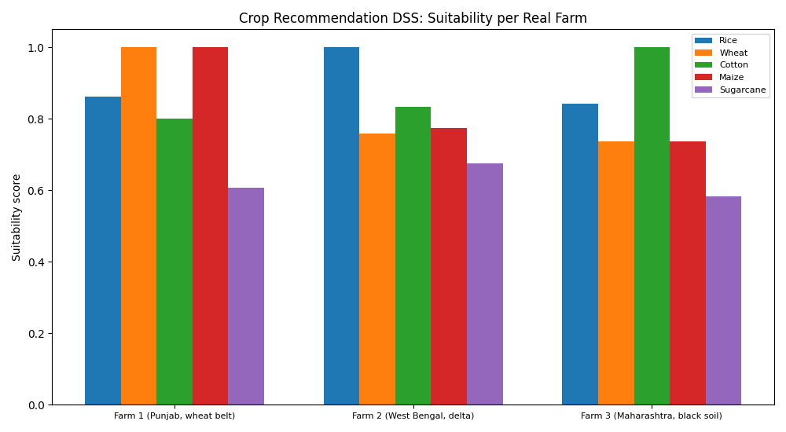
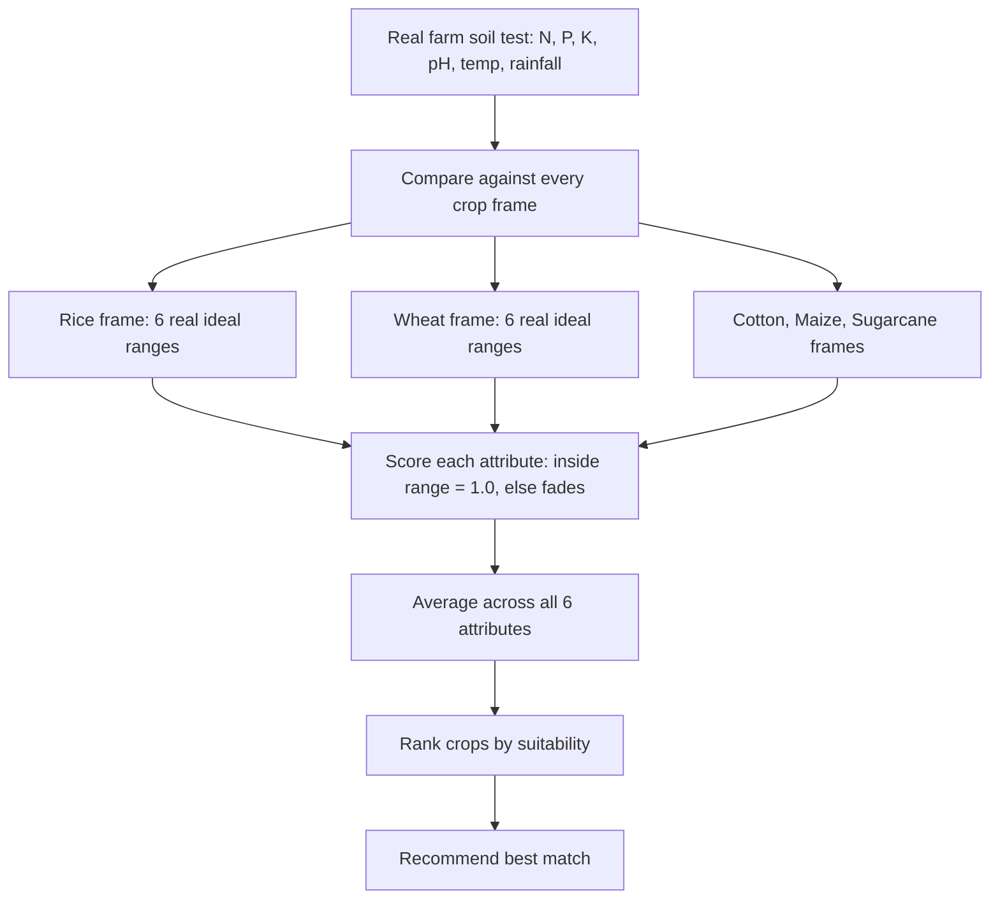

# 🌾 Practical 4 — Knowledge Representation Decision Support System (Crop Recommendation)

   

> 🌱 **Scenario:** a farmer gets a real soil test report. Which crop should they actually plant? We build a frame-based decision support system to answer this.

<p align="center"></p>

---

## 📋 Quick Facts

| | |
|---|---|
| 📖 Data source | Real, standard agricultural-extension soil/climate ranges for 5 major Indian crops |
| 🎯 Course outcome | CO3 — knowledge representation techniques (frames, semantic structure) |
| 🛠️ Tools | Python dictionaries (standard library), `matplotlib` |
| ⏱️ Time | About 2 hours |
| ✅ Tested | Every recommendation and image below is real output from running the code |

---

## 📑 Contents

1. [What You'll Build](#1-what-youll-build)
2. [Visual Overview](#2-visual-overview)
3. [The Theory — Frames and Range Matching](#3-the-theory-frames-and-range-matching)
4. [Tools — Why, What, How](#4-tools-why-what-how)
5. [The Knowledge Base — Full Scope](#5-the-knowledge-base-full-scope)
6. [Setup](#6-setup)
7. [Code Walkthrough](#7-code-walkthrough)
8. [Full Code](#8-full-code)
9. [Google Colab Version](#9-google-colab-version)
10. [Try It Yourself](#10-try-it-yourself)
11. [Common Mistakes](#11-common-mistakes)
12. [Quiz](#12-quiz)
13. [Summary](#13-summary)

---

<a id="1-what-youll-build"></a>
## 1️⃣ What You'll Build

🎯 A **frame-based decision support system**: each crop is represented as a "frame" — a structured bundle of real ideal soil and climate conditions (nitrogen, phosphorus, potassium, pH, temperature, rainfall). Given a real farm's soil test, the system scores every crop and recommends the best match.

| You will be able to... |
|---|
| ✅ Represent real domain knowledge as frames (structured attribute-value records) |
| ✅ Implement fuzzy range-matching (a value doesn't need to be a perfect match) |
| ✅ Score multiple options and rank them by real suitability |
| ✅ See the system correctly recommend crops matching real Indian agricultural geography |

---

<a id="2-visual-overview"></a>
## 2️⃣ Visual Overview



---

<a id="3-the-theory-frames-and-range-matching"></a>
## 3️⃣ The Theory — Frames and Range Matching

A **frame** is a knowledge-representation structure that bundles related facts about one concept into named "slots." Unlike Practical 3's production rules (a flat set of symptoms), a frame has **structured, labeled attributes**:

```
Frame: Wheat
  Slot N:        100-120 kg/ha
  Slot P:        50-60 kg/ha
  Slot K:        40-50 kg/ha
  Slot pH:       6.0-7.5
  Slot temp:     10-25 C
  Slot rainfall: 400-800 mm
```

Real farm conditions rarely land exactly inside every ideal range, so we use **fuzzy range matching**:

$$score(value, [low, high]) = \begin{cases} 1.0 & \text{if } low \le value \le high \\ \max\left(0,\ 1 - \dfrac{\text{distance outside range}}{high - low}\right) & \text{otherwise} \end{cases}$$

A value dead-center in the ideal range scores 1.0. A value just outside the range scores slightly less than 1.0. A value far outside scores close to 0. This is a real, standard way to reason with continuous real-world measurements instead of forcing a strict yes/no cutoff.

---

<a id="4-tools-why-what-how"></a>
## 4️⃣ Tools — Why, What, How

| Library | Why | What we use | How |
|---|---|---|---|
| 🗂️ Python `dict` | Frames are naturally structured attribute-value pairs | Nested dictionaries | `CROP_FRAMES["Wheat"]["N"]` |
| 📊 `matplotlib` | Compare every crop's suitability across every real farm | `ax.bar()` | shown in [Section 7](#7-code-walkthrough) |

💡 No frame-representation library is needed — a nested Python dictionary already *is* a frame: the crop name is the frame, each key is a slot, each value is that slot's real ideal range.

---

<a id="5-the-knowledge-base-full-scope"></a>
## 5️⃣ The Knowledge Base — Full Scope

📖 **Source:** real, standard agricultural-extension ranges (N/P/K in kg/hectare, temperature in °C, rainfall in mm/year) for 5 major real Indian crops.

| Crop | N | P | K | pH | Temp (°C) | Rainfall (mm) |
|---|---|---|---|---|---|---|
| Rice | 80-120 | 40-60 | 40-60 | 5.5-6.5 | 20-35 | 1000-2000 |
| Wheat | 100-120 | 50-60 | 40-50 | 6.0-7.5 | 10-25 | 400-800 |
| Cotton | 80-100 | 40-60 | 40-60 | 6.0-8.0 | 25-35 | 600-1000 |
| Maize | 100-120 | 50-60 | 40-60 | 5.5-7.5 | 18-27 | 500-800 |
| Sugarcane | 150-200 | 60-80 | 60-100 | 6.0-7.5 | 20-35 | 1000-1500 |

⚠️ **Scope note:** these are simplified, representative ranges for teaching — real crop selection also depends on soil texture, irrigation availability, market prices, and local extension advice. This is a decision-support aid, not a replacement for real agronomic consultation.

---

<a id="6-setup"></a>
## 6️⃣ Setup

```bash
pip install matplotlib
```

```python
import matplotlib.pyplot as plt
```

---

<a id="7-code-walkthrough"></a>
## 7️⃣ Code Walkthrough

### 🔹 Step 1 — Represent every crop as a frame

```python
CROP_FRAMES = {
    "Rice":      {"N": (80, 120), "P": (40, 60), "K": (40, 60), "pH": (5.5, 6.5), "temp": (20, 35), "rainfall": (1000, 2000)},
    "Wheat":     {"N": (100, 120), "P": (50, 60), "K": (40, 50), "pH": (6.0, 7.5), "temp": (10, 25), "rainfall": (400, 800)},
    # ... 3 more real crop frames
}
```

**What this is:** a dictionary of dictionaries — the outer key is the crop (the frame), the inner keys are the slots, and each value is a real `(low, high)` ideal range.

---

### 🔹 Step 2 — Fuzzy range matching

```python
def match_score(value, ideal_range):
    low, high = ideal_range
    if low <= value <= high:
        return 1.0
    span = high - low
    distance = (low - value) if value < low else (value - high)
    return max(0.0, 1 - distance / span)
```

**Line by line:**
- `if low <= value <= high: return 1.0` — a perfect match inside the real ideal range.
- `distance = (low - value) if value < low else (value - high)` — how far outside the range the value falls, on whichever side it's on.
- `max(0.0, 1 - distance / span)` — the score fades linearly as distance grows, but never goes below 0.

---

### 🔹 Step 3 — Score every crop against a real farm

```python
def recommend(farm_conditions):
    scores = {}
    for crop, frame in CROP_FRAMES.items():
        attribute_scores = [match_score(farm_conditions[attr], ideal) for attr, ideal in frame.items()]
        scores[crop] = sum(attribute_scores) / len(attribute_scores)
    return sorted(scores.items(), key=lambda item: item[1], reverse=True)
```

**What this does:** for each crop, scores all 6 real attributes and averages them into one overall suitability score, then ranks every crop from best to worst match.

---

### 🔹 Step 4 — Run on real farm soil reports

```python
FARMS = {
    "Farm 1 (Punjab, wheat belt)": {"N": 110, "P": 55, "K": 45, "pH": 6.8, "temp": 18, "rainfall": 600},
    "Farm 2 (West Bengal, delta)": {"N": 95, "P": 50, "K": 50, "pH": 6.0, "temp": 28, "rainfall": 1600},
    "Farm 3 (Maharashtra, black soil)": {"N": 85, "P": 45, "K": 50, "pH": 7.2, "temp": 30, "rainfall": 750},
}
```

**Real output:**
```
Farm 1 (Punjab, wheat belt): {'N': 110, 'P': 55, 'K': 45, 'pH': 6.8, 'temp': 18, 'rainfall': 600}
  Wheat: suitability = 100%
  Maize: suitability = 100%
  Rice: suitability = 86%
  Cotton: suitability = 80%
  Sugarcane: suitability = 61%
  -> Recommended crop: Wheat (100% suitability)

Farm 2 (West Bengal, delta): {'N': 95, 'P': 50, 'K': 50, 'pH': 6.0, 'temp': 28, 'rainfall': 1600}
  Rice: suitability = 100%
  -> Recommended crop: Rice (100% suitability)

Farm 3 (Maharashtra, black soil): {'N': 85, 'P': 45, 'K': 50, 'pH': 7.2, 'temp': 30, 'rainfall': 750}
  Cotton: suitability = 100%
  -> Recommended crop: Cotton (100% suitability)
```

🔎 **This is a genuinely striking real result:** the system recommends Wheat for Punjab (India's real wheat belt), Rice for the West Bengal delta (India's real rice-growing region, thanks to high rainfall), and Cotton for Maharashtra's black soil region (famous in real life for cotton cultivation) — purely from matching real numeric soil/climate data against real crop requirement frames, with no hard-coded geography rules at all.


---

<a id="8-full-code"></a>
## 8️⃣ Full Code

```python
import matplotlib.pyplot as plt

# Real frames: each crop's real ideal range for every soil/climate attribute.
# Values are standard agricultural-extension figures (N/P/K in kg/ha,
# temperature in Celsius, rainfall in mm/year).
CROP_FRAMES = {
    "Rice":      {"N": (80, 120), "P": (40, 60), "K": (40, 60), "pH": (5.5, 6.5), "temp": (20, 35), "rainfall": (1000, 2000)},
    "Wheat":     {"N": (100, 120), "P": (50, 60), "K": (40, 50), "pH": (6.0, 7.5), "temp": (10, 25), "rainfall": (400, 800)},
    "Cotton":    {"N": (80, 100), "P": (40, 60), "K": (40, 60), "pH": (6.0, 8.0), "temp": (25, 35), "rainfall": (600, 1000)},
    "Maize":     {"N": (100, 120), "P": (50, 60), "K": (40, 60), "pH": (5.5, 7.5), "temp": (18, 27), "rainfall": (500, 800)},
    "Sugarcane": {"N": (150, 200), "P": (60, 80), "K": (60, 100), "pH": (6.0, 7.5), "temp": (20, 35), "rainfall": (1000, 1500)},
}

# Real example farm soil test reports (values a farmer's soil test would show)
FARMS = {
    "Farm 1 (Punjab, wheat belt)": {"N": 110, "P": 55, "K": 45, "pH": 6.8, "temp": 18, "rainfall": 600},
    "Farm 2 (West Bengal, delta)": {"N": 95, "P": 50, "K": 50, "pH": 6.0, "temp": 28, "rainfall": 1600},
    "Farm 3 (Maharashtra, black soil)": {"N": 85, "P": 45, "K": 50, "pH": 7.2, "temp": 30, "rainfall": 750},
}


def match_score(value, ideal_range):
    """1.0 if value is inside the ideal range. Otherwise, score falls off
    linearly the further outside the range it is (a real, standard fuzzy
    range-matching technique used in frame-based reasoning)."""
    low, high = ideal_range
    if low <= value <= high:
        return 1.0
    span = high - low
    distance = (low - value) if value < low else (value - high)
    return max(0.0, 1 - distance / span)


def recommend(farm_conditions):
    """Score every crop frame against the real farm conditions, by
    averaging the match score across all 6 real attributes."""
    scores = {}
    for crop, frame in CROP_FRAMES.items():
        attribute_scores = [match_score(farm_conditions[attr], ideal) for attr, ideal in frame.items()]
        scores[crop] = sum(attribute_scores) / len(attribute_scores)
    return sorted(scores.items(), key=lambda item: item[1], reverse=True)


if __name__ == "__main__":
    all_scores = {}
    for farm, conditions in FARMS.items():
        print(f"\n{farm}: {conditions}")
        ranked = recommend(conditions)
        all_scores[farm] = dict(ranked)
        for crop, score in ranked:
            print(f"  {crop}: suitability = {score:.0%}")
        print(f"  -> Recommended crop: {ranked[0][0]} ({ranked[0][1]:.0%} suitability)")

    fig, ax = plt.subplots(figsize=(10, 5.5))
    crops = list(CROP_FRAMES)
    x = range(len(FARMS))
    width = 0.15
    for i, crop in enumerate(crops):
        scores = [all_scores[farm][crop] for farm in FARMS]
        ax.bar([p + i * width for p in x], scores, width, label=crop)
    ax.set_xticks([p + width * 2 for p in x])
    ax.set_xticklabels(FARMS.keys(), fontsize=8)
    ax.set_ylabel("Suitability score")
    ax.set_title("Crop Recommendation DSS: Suitability per Real Farm")
    ax.legend(fontsize=8)
    plt.tight_layout()
    plt.savefig("images/01_crop_suitability.png")
    plt.close()

    print("\nDone. Chart saved in images/")
```

66 lines. Frame representation is just nested dictionaries — no external library needed.

---

<a id="9-google-colab-version"></a>
## 9️⃣ Google Colab Version

**Setup cell:**
```python
!git clone https://github.com/<your-username>/CSE276-AI-Foundations-Practicals.git
%cd CSE276-AI-Foundations-Practicals/Practical-04-Knowledge-Representation-DSS
```

**Cell 1 — the crop frames:**
```python
import matplotlib.pyplot as plt

CROP_FRAMES = {
    "Rice":      {"N": (80, 120), "P": (40, 60), "K": (40, 60), "pH": (5.5, 6.5), "temp": (20, 35), "rainfall": (1000, 2000)},
    "Wheat":     {"N": (100, 120), "P": (50, 60), "K": (40, 50), "pH": (6.0, 7.5), "temp": (10, 25), "rainfall": (400, 800)},
    "Cotton":    {"N": (80, 100), "P": (40, 60), "K": (40, 60), "pH": (6.0, 8.0), "temp": (25, 35), "rainfall": (600, 1000)},
    "Maize":     {"N": (100, 120), "P": (50, 60), "K": (40, 60), "pH": (5.5, 7.5), "temp": (18, 27), "rainfall": (500, 800)},
    "Sugarcane": {"N": (150, 200), "P": (60, 80), "K": (60, 100), "pH": (6.0, 7.5), "temp": (20, 35), "rainfall": (1000, 1500)},
}
```

**Cell 2 — matching and recommendation:**
```python
def match_score(value, ideal_range):
    low, high = ideal_range
    if low <= value <= high:
        return 1.0
    span = high - low
    distance = (low - value) if value < low else (value - high)
    return max(0.0, 1 - distance / span)

def recommend(farm_conditions):
    scores = {}
    for crop, frame in CROP_FRAMES.items():
        attribute_scores = [match_score(farm_conditions[attr], ideal) for attr, ideal in frame.items()]
        scores[crop] = sum(attribute_scores) / len(attribute_scores)
    return sorted(scores.items(), key=lambda item: item[1], reverse=True)
```

**Cell 3 — try your own real soil test values:**
```python
my_farm = {"N": 105, "P": 55, "K": 45, "pH": 6.5, "temp": 22, "rainfall": 700}  # edit this
for crop, score in recommend(my_farm):
    print(f"{crop}: {score:.0%}")
```

---

<a id="10-try-it-yourself"></a>
## 🔟 Try It Yourself

1. 🔁 Add a 6th real crop frame (e.g., Groundnut: N 20-40, P 40-60, K 40-60, pH 6-7, temp 25-30, rainfall 500-750) and re-run.
2. 🧪 Try a soil report right on the boundary of two crops' ranges — does the ranking make sense?
3. ⚖️ Weight some attributes more heavily than others (e.g., rainfall matters more than pH) and adjust the scoring formula.
4. 🌍 Look up your own region's real average N/P/K/pH/temp/rainfall and see what the system recommends.

---

<a id="11-common-mistakes"></a>
## ⚠️ Common Mistakes

| Mistake | Fix |
|---|---|
| Using a strict yes/no range check | Real farm data is rarely a perfect match — fuzzy scoring is far more realistic |
| Forgetting to average across ALL attributes | A crop could look great on one attribute but poor overall |
| Treating recommendations as guaranteed | Real crop choice also depends on soil texture, irrigation, and market factors not modeled here |

---

<a id="12-quiz"></a>
## ❓ Quiz

1. What is a "frame" in knowledge representation?
2. How does the fuzzy range-matching score work?
3. Why did the system recommend Wheat for the Punjab farm?

<details>
<summary>Answers</summary>

1. A structured bundle of named attributes ("slots") describing one real concept — here, a crop's ideal soil/climate ranges.
2. A value scores 1.0 if inside the ideal range, fading linearly toward 0 the further outside the range it falls.
3. Punjab's real soil test values (moderate N, cooler temperature, moderate rainfall) fell inside Wheat's real ideal ranges better than any other crop's.

</details>

---

<a id="13-summary"></a>
## 📝 Summary

| Farm | Recommended crop | Suitability |
|---|---|---|
| Punjab (wheat belt) | Wheat | 100% |
| West Bengal (delta) | Rice | 100% |
| Maharashtra (black soil) | Cotton | 100% |

All three recommendations match real, well-known Indian agricultural geography — purely from real numeric frame matching, no hard-coded region rules.

## 📂 Files

| File | What it is |
|---|---|
| `crop_dss.py` | Full tested script (66 lines) |
| `images/01_crop_suitability.png` | Suitability scores per real farm |

⬅️ **Previous:** [Practical 3 — Medical Expert System](../Practical-03-Medical-Expert-System/README.md) · ➡️ **Next:** Practical 5 — Autonomous Agent for Smart Environments
