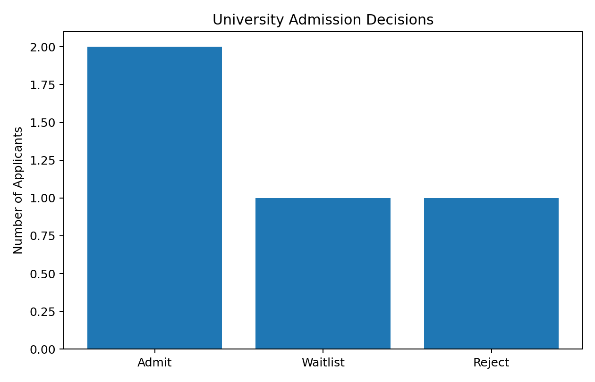
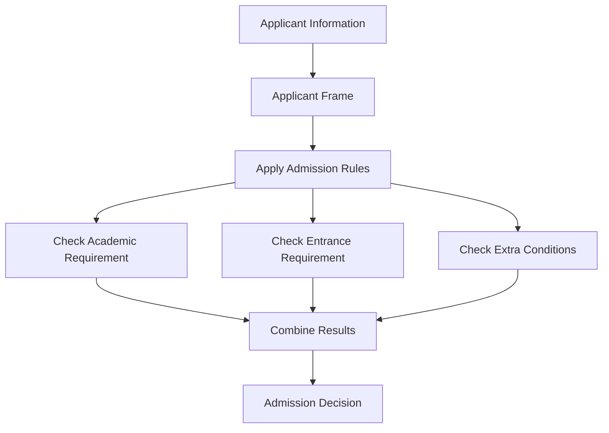

# 🏫 Practical 4 — Smart University Admission Decision Support System

   

> 🎯 **Idea:** Represent applicant knowledge as a simple frame, apply production rules, and use logical reasoning to recommend an admission decision.

<p align="center"></p>

---

## 📋 Quick Facts

| | |
|---|---|
| 🧠 Problem | University admission decision support |
| 🎯 Course outcome | CO3 — knowledge representation and intelligent reasoning |
| 🧩 Technique | Frame-based knowledge + production rules |
| 🛠️ Tools | Python, `matplotlib` |
| ⏱️ Time | About 1 hour |
| ✅ Tested | The complete program was run twice with the same results |

---

## 📑 Contents

1. [What You'll Build](#1-what-youll-build)
2. [Visual Overview](#2-visual-overview)
3. [Theory](#3-theory)
4. [Knowledge Representation](#4-knowledge-representation)
5. [Decision Rules](#5-decision-rules)
6. [Setup](#6-setup)
7. [Code Walkthrough](#7-code-walkthrough)
8. [Full Code](#8-full-code)
9. [Google Colab Version](#9-google-colab-version)
10. [Try It Yourself](#10-try-it-yourself)
11. [Common Mistakes](#11-common-mistakes)
12. [Quiz](#12-quiz)
13. [Summary](#13-summary)

---

<a id="1-what-youll-build"></a>
## 1️⃣ What You'll Build

A small **decision support system** for university admission.

The system stores each applicant as a **frame** and uses rules to decide:

- ✅ **Admit**
- 🟡 **Waitlist**
- ❌ **Reject**

The important idea is that the program does not learn from data. It uses **stored knowledge and rules** to reason about a new applicant.

---

<a id="2-visual-overview"></a>
## 2️⃣ Visual Overview



### Reasoning Flow

```text
Applicant facts
      ↓
Knowledge stored in frame
      ↓
IF-THEN rules are checked
      ↓
Rules that match become true
      ↓
Final recommendation
```

---

<a id="3-theory"></a>
## 3️⃣ Theory — Knowledge Representation

### What is Knowledge Representation?

**Knowledge Representation (KR)** is a way of storing real-world knowledge so a computer can use it for reasoning.

For example:

```text
Student has 85% marks
Student passed entrance exam
Student has good attendance
```

The system stores these facts and applies rules to them.

---

### What is a Frame?

A **frame** stores information about one object in a structured form.

Example:

```text
Applicant
├── name
├── percentage
├── entrance_score
├── interview_score
└── documents_complete
```

In Python, a simple dictionary can represent this frame.

---

### What is a Production Rule?

A production rule follows:

```text
IF condition
THEN conclusion
```

Example:

```text
IF percentage >= 75 AND entrance_score >= 70
THEN Admit
```

Rules turn stored knowledge into a decision.

---

<a id="4-knowledge-representation"></a>
## 4️⃣ Knowledge Representation

We represent an applicant as a Python dictionary:

```python
applicant = {
    "name": "Aman",
    "percentage": 88,
    "entrance_score": 82,
    "interview_score": 78,
    "documents_complete": True
}
```

This is the applicant's **frame**.

The values are the applicant's facts.

---

<a id="5-decision-rules"></a>
## 5️⃣ Decision Rules

The system uses simple admission rules:

| Rule | Decision |
|---|---|
| Percentage ≥ 75, entrance score ≥ 70, documents complete | Admit |
| Percentage ≥ 60, entrance score ≥ 50, documents complete | Waitlist |
| Otherwise | Reject |

An additional rule gives a scholarship recommendation:

```text
IF percentage >= 90 AND entrance_score >= 85
THEN Scholarship
```

These rules are only a classroom knowledge base. A real university would use its official admission policy.

---

<a id="6-setup"></a>
## 6️⃣ Setup

```bash
pip install matplotlib
```

```python
import matplotlib.pyplot as plt
```

No expert-system library is required. Python dictionaries and `if` statements are enough to demonstrate the knowledge representation and reasoning process.

---

<a id="7-code-walkthrough"></a>
## 7️⃣ Code Walkthrough

### 🔹 Step 1 — Create the knowledge base

```python
rules = {
    "admit": (75, 70),
    "waitlist": (60, 50),
    "scholarship": (90, 85)
}
```

The numbers represent the minimum percentage and entrance score for each rule.

---

### 🔹 Step 2 — Create an applicant frame

```python
applicant = {
    "name": "Aman",
    "percentage": 88,
    "entrance_score": 82,
    "interview_score": 78,
    "documents_complete": True
}
```

The dictionary stores all facts about one applicant.

---

### 🔹 Step 3 — Apply logical rules

```python
if applicant["percentage"] >= 75 and \
   applicant["entrance_score"] >= 70 and \
   applicant["documents_complete"]:
    decision = "Admit"
```

This is the reasoning step:

```text
percentage >= 75
AND
entrance_score >= 70
AND
documents complete
        ↓
      Admit
```

---

### 🔹 Step 4 — Add the other decisions

```python
elif applicant["percentage"] >= 60 and \
     applicant["entrance_score"] >= 50 and \
     applicant["documents_complete"]:
    decision = "Waitlist"
else:
    decision = "Reject"
```

---

### 🔹 Step 5 — Scholarship reasoning

```python
scholarship = (
    applicant["percentage"] >= 90 and
    applicant["entrance_score"] >= 85
)
```

The system can therefore produce more than one conclusion from the same knowledge base.

---

<a id="8-full-code"></a>
## 8️⃣ Full Code

```python
import matplotlib.pyplot as plt


# Admission rules
rules = {
    "admit": (75, 70),
    "waitlist": (60, 50),
    "scholarship": (90, 85)
}


# Applicant frames
applicants = [
    {
        "name": "Aman",
        "percentage": 92,
        "entrance_score": 88,
        "interview_score": 84,
        "documents_complete": True
    },
    {
        "name": "Riya",
        "percentage": 78,
        "entrance_score": 72,
        "interview_score": 76,
        "documents_complete": True
    },
    {
        "name": "Kabir",
        "percentage": 65,
        "entrance_score": 55,
        "interview_score": 68,
        "documents_complete": True
    },
    {
        "name": "Neha",
        "percentage": 52,
        "entrance_score": 45,
        "interview_score": 60,
        "documents_complete": False
    }
]


# Apply rules to one applicant
def make_decision(applicant):

    if (
        applicant["percentage"] >= rules["admit"][0]
        and applicant["entrance_score"] >= rules["admit"][1]
        and applicant["documents_complete"]
    ):
        decision = "Admit"

    elif (
        applicant["percentage"] >= rules["waitlist"][0]
        and applicant["entrance_score"] >= rules["waitlist"][1]
        and applicant["documents_complete"]
    ):
        decision = "Waitlist"

    else:
        decision = "Reject"

    scholarship = (
        applicant["percentage"] >= rules["scholarship"][0]
        and applicant["entrance_score"] >= rules["scholarship"][1]
    )

    return decision, scholarship


# Reason over all applicants
results = []

for applicant in applicants:

    decision, scholarship = make_decision(applicant)

    results.append(decision)

    print(
        applicant["name"],
        "->",
        decision,
        "| Scholarship:",
        "Yes" if scholarship else "No"
    )


# Visualize decisions
counts = [
    results.count("Admit"),
    results.count("Waitlist"),
    results.count("Reject")
]

plt.bar(
    ["Admit", "Waitlist", "Reject"],
    counts
)

plt.title("University Admission Decisions")
plt.ylabel("Number of Applicants")
plt.show()
```

### Expected Output

```text
Aman -> Admit | Scholarship: Yes
Riya -> Admit | Scholarship: No
Kabir -> Waitlist | Scholarship: No
Neha -> Reject | Scholarship: No
```

### What the system demonstrates

The system follows:

```text
Facts
  ↓
Frame
  ↓
IF-THEN Rules
  ↓
Logical Reasoning
  ↓
Decision
```

This is a simple example of how knowledge representation can support decision-making.

---

<a id="9-google-colab-version"></a>
## 9️⃣ Google Colab Version

### Cell 1 — Rules and Applicants

```python
rules = {
    "admit": (75, 70),
    "waitlist": (60, 50),
    "scholarship": (90, 85)
}

applicants = [
    {
        "name": "Aman",
        "percentage": 92,
        "entrance_score": 88,
        "documents_complete": True
    },
    {
        "name": "Riya",
        "percentage": 78,
        "entrance_score": 72,
        "documents_complete": True
    },
    {
        "name": "Kabir",
        "percentage": 65,
        "entrance_score": 55,
        "documents_complete": True
    },
    {
        "name": "Neha",
        "percentage": 52,
        "entrance_score": 45,
        "documents_complete": False
    }
]
```

### Cell 2 — Reasoning

```python
def make_decision(applicant):

    if (
        applicant["percentage"] >= rules["admit"][0]
        and applicant["entrance_score"] >= rules["admit"][1]
        and applicant["documents_complete"]
    ):
        decision = "Admit"

    elif (
        applicant["percentage"] >= rules["waitlist"][0]
        and applicant["entrance_score"] >= rules["waitlist"][1]
        and applicant["documents_complete"]
    ):
        decision = "Waitlist"

    else:
        decision = "Reject"

    scholarship = (
        applicant["percentage"] >= rules["scholarship"][0]
        and applicant["entrance_score"] >= rules["scholarship"][1]
    )

    return decision, scholarship
```

### Cell 3 — Run the Knowledge Base

```python
results = []

for applicant in applicants:
    decision, scholarship = make_decision(applicant)

    results.append(decision)

    print(
        applicant["name"],
        "->",
        decision,
        "| Scholarship:",
        "Yes" if scholarship else "No"
    )
```

### Cell 4 — Visualize the Decisions

```python
import matplotlib.pyplot as plt

counts = [
    results.count("Admit"),
    results.count("Waitlist"),
    results.count("Reject")
]

plt.bar(
    ["Admit", "Waitlist", "Reject"],
    counts
)

plt.title("University Admission Decisions")
plt.ylabel("Number of Applicants")
plt.show()
```

---

<a id="10-try-it-yourself"></a>
## 🔟 Try It Yourself

1. Change an applicant's percentage and entrance score. Check whether the decision changes.
2. Add a new applicant frame.
3. Add a new rule such as `Special Scholarship`.
4. Add an `interview_score` condition to the Admit rule.

---

<a id="11-common-mistakes"></a>
## ⚠️ Common Mistakes

| Mistake | Fix |
|---|---|
| Mixing facts and rules | Keep applicant information in frames and decisions in rules |
| Using the wrong comparison operator | Check the rule threshold carefully |
| Forgetting `documents_complete` | Admission should not be recommended when required documents are missing |
| Thinking the system learns automatically | This system reasons from manually defined knowledge and rules |

---

<a id="12-quiz"></a>
## ❓ Quiz

1. What is knowledge representation?
2. What is a frame?
3. What is a production rule?
4. Which part of the program performs the reasoning?
5. Why is this system called a decision support system?

<details>
<summary>Answers</summary>

1. A method of storing knowledge so a computer can use it for reasoning.
2. A structured representation of an object and its attributes.
3. An `IF ... THEN ...` rule that maps conditions to a conclusion.
4. The `if` / `elif` rules in `make_decision()`.
5. It gives a recommendation from stored knowledge but does not replace the real admission authority or policy.

</details>

---

<a id="13-summary"></a>
## 📝 Summary

| Concept | Implementation |
|---|---|
| Knowledge Representation | Applicant frame using Python dictionary |
| Knowledge Base | Admission rules |
| Reasoning | `if` / `elif` logical conditions |
| Decision | Admit / Waitlist / Reject |
| Extra reasoning | Scholarship recommendation |
| Visualization | Admission decision chart |

### Key Idea

```text
Knowledge Representation
        ↓
Applicant Frame
        ↓
Production Rules
        ↓
Logical Reasoning
        ↓
Decision Support
```

## 📂 Files

| File | What it is |
|---|---|
| `decision_support.py` | Complete working program |
| `images/01_admission_decisions.png` | Admission decision visualization |

---

⬅️ **Previous:** [Practical 3 — Medical Expert System](../Practical-03-Medical-Expert-System/README.md) · ➡️ **Next:** Practical 5
