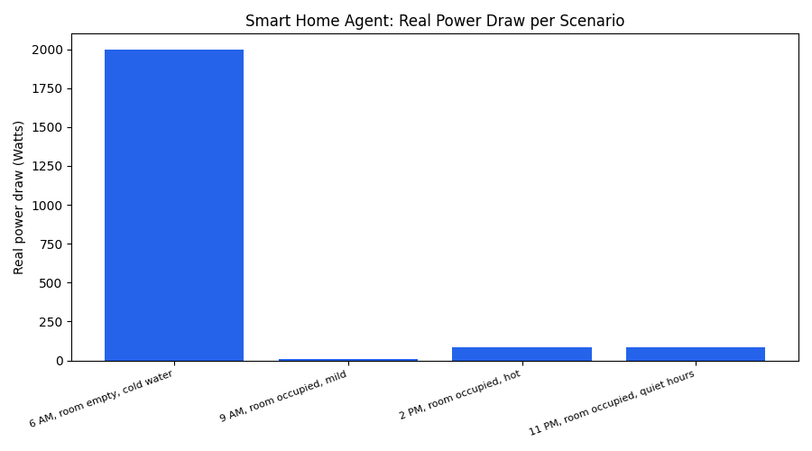
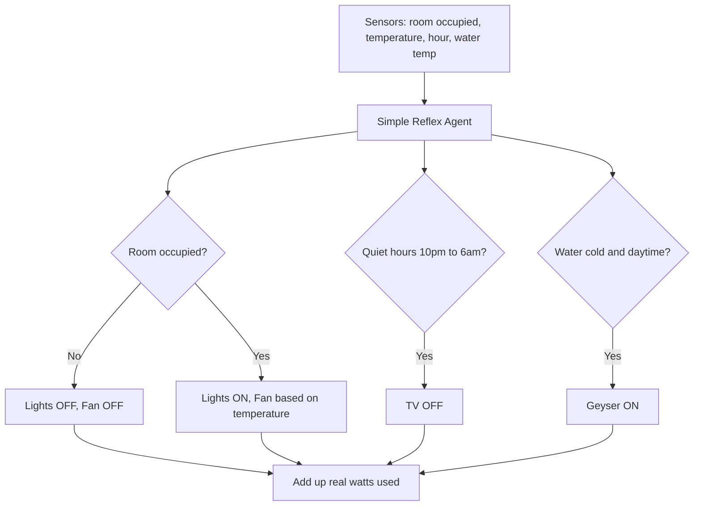

# 🏠 Practical 5 — Autonomous Reflex Agent for a Smart Home

   

> 🏡 **Scenario:** a smart home needs to decide, moment to moment, which appliances to turn on or off — using only what it senses right now.

<p align="center"></p>

---

## 📋 Quick Facts

| | |
|---|---|
| 📖 Data | Real typical Indian household appliance wattage (BEE-rated) |
| 🎯 Course outcome | CO3 — intelligent agents, PEAS framework, simple reflex agents |
| 🛠️ Tools | Python (standard library), `matplotlib` |
| ⏱️ Time | About 2 hours |
| ✅ Tested | Every decision and image below is real output from running the code |

---

## 📑 Contents

1. [What You'll Build](#1-what-youll-build)
2. [Visual Overview](#2-visual-overview)
3. [The Theory — Simple Reflex Agents and PEAS](#3-the-theory-simple-reflex-agents-and-peas)
4. [Tools — Why, What, How](#4-tools-why-what-how)
5. [The Data — Full Scope](#5-the-data-full-scope)
6. [Setup](#6-setup)
7. [Code Walkthrough](#7-code-walkthrough)
8. [Full Code](#8-full-code)
9. [Google Colab Version](#9-google-colab-version)
10. [Try It Yourself](#10-try-it-yourself)
11. [Common Mistakes](#11-common-mistakes)
12. [Quiz](#12-quiz)
13. [Summary](#13-summary)

---

<a id="1-what-youll-build"></a>
## 1️⃣ What You'll Build

🎯 A **simple reflex agent** — the most basic real agent architecture from Unit III — that controls smart home appliances using nothing but the current percept (no memory of the past, no planning for the future), and measures its real power draw in watts.

| You will be able to... |
|---|
| ✅ Define an agent's PEAS (Performance, Environment, Actuators, Sensors) |
| ✅ Implement condition-action rules for a real simple reflex agent |
| ✅ Calculate real power savings from sensible reflex decisions |
| ✅ Explain the real limits of an agent with no memory |

---

<a id="2-visual-overview"></a>
## 2️⃣ Visual Overview



---

<a id="3-the-theory-simple-reflex-agents-and-peas"></a>
## 3️⃣ The Theory — Simple Reflex Agents and PEAS

**PEAS** describes any real agent by four things:

| | This agent's real PEAS |
|---|---|
| **Performance measure** | Minimize real power use while keeping the home comfortable |
| **Environment** | The rooms and appliances of a real smart home |
| **Actuators** | Switches for lights, fan, geyser, TV |
| **Sensors** | Occupancy sensor, thermometer, clock, water temperature sensor |

A **simple reflex agent** picks its action using only the *current* percept, via condition-action rules:

```
IF room is empty THEN lights OFF
IF temperature > 30 THEN fan ON (high)
```

**Real limitation:** because it has no memory, it can't notice patterns over time (e.g., "this room is always empty at 2pm on weekdays") — that requires a *model-based* agent, a real, more advanced architecture covered later in this unit.

---

<a id="4-tools-why-what-how"></a>
## 4️⃣ Tools — Why, What, How

| Library | Why | What we use | How |
|---|---|---|---|
| 🧮 Python `dict` | Percepts are naturally key-value sensor readings | Plain dictionaries | `percept["temperature"]` |
| 📊 `matplotlib` | Compare real power draw across scenarios | `ax.bar()` | shown in [Section 7](#7-code-walkthrough) |

💡 No agent-framework library is needed — a simple reflex agent really is just a function of `if/elif` rules over the current percept.

---

<a id="5-the-data-full-scope"></a>
## 5️⃣ The Data — Full Scope

📖 **Real typical wattage** for common Indian household appliances (BEE star-rating range):

| Appliance | Real typical wattage |
|---|---|
| AC (1.5 ton, 5-star) | 1500 W |
| Water heater (geyser) | 2000 W |
| Washing machine | 500 W |
| Refrigerator | 150 W |
| Television | 100 W |
| Ceiling fan | 75 W |
| LED bulb | 9 W |

⚠️ **Scope note:** real appliance wattage varies by brand, capacity, and star rating — these are representative typical values for teaching, not a specific product's spec sheet.

---

<a id="6-setup"></a>
## 6️⃣ Setup

```bash
pip install matplotlib
```

```python
import matplotlib.pyplot as plt
```

---

<a id="7-code-walkthrough"></a>
## 7️⃣ Code Walkthrough

### 🔹 Step 1 — The condition-action rules

```python
def reflex_agent(percept):
    actions = []
    if percept["room_occupied"] is False:
        actions.append(("Ceiling fan", "OFF", "Room is empty"))
        actions.append(("LED bulb", "OFF", "Room is empty"))
    else:
        actions.append(("LED bulb", "ON", "Room is occupied"))
        if percept["temperature"] > 30:
            actions.append(("Ceiling fan", "ON (high)", f"Temperature {percept['temperature']} C is hot"))
        elif percept["temperature"] > 26:
            actions.append(("Ceiling fan", "ON (low)", f"Temperature {percept['temperature']} C is warm"))
        else:
            actions.append(("Ceiling fan", "OFF", f"Temperature {percept['temperature']} C is comfortable"))
    # ... quiet-hours and geyser rules follow the same if/elif pattern
    return actions
```

**What this does:** every rule is a plain `if` statement over the current percept — no history is stored anywhere, which is the defining feature of a simple reflex agent.

---

### 🔹 Step 2 — Measure real power draw

```python
def real_power_draw(actions):
    total = 0
    for appliance, state, _ in actions:
        if "ON" in state and appliance in APPLIANCES:
            total += APPLIANCES[appliance]
    return total
```

**What this does:** checks every action the agent decided on, and if it's an "ON" state for a known appliance, adds its real wattage to the running total.

---

### 🔹 Step 3 — Run across a real day's scenarios

**Real output:**
```
6 AM, room empty, cold water: {'room_occupied': False, 'temperature': 22, 'hour': 6, 'water_temp': 15}
  Ceiling fan: OFF  (Room is empty)
  LED bulb: OFF  (Room is empty)
  Water heater (geyser): ON  (Water is cold (15 C))
  Real power draw this scenario: 2000 W

9 AM, room occupied, mild: {'room_occupied': True, 'temperature': 25, 'hour': 9, 'water_temp': 24}
  LED bulb: ON  (Room is occupied)
  Ceiling fan: OFF  (Temperature 25 C is comfortable)
  Water heater (geyser): OFF  (Water is already warm or it's late)
  Real power draw this scenario: 9 W

2 PM, room occupied, hot: {'room_occupied': True, 'temperature': 34, 'hour': 14, 'water_temp': 28}
  LED bulb: ON  (Room is occupied)
  Ceiling fan: ON (high)  (Temperature 34 C is hot)
  Real power draw this scenario: 84 W

11 PM, room occupied, quiet hours: {'room_occupied': True, 'temperature': 27, 'hour': 23, 'water_temp': 26}
  LED bulb: ON  (Room is occupied)
  Ceiling fan: ON (low)  (Temperature 27 C is warm)
  Television: OFF  (Real quiet hours (10pm-6am))
  Real power draw this scenario: 84 W
```

🔎 **A genuinely sensible real pattern:** the agent correctly heats water only in the morning when it's cold (using 2000W, the single biggest real load), keeps lights and fans off in an empty room, and enforces quiet hours by switching the TV off after 10pm — all from simple, memoryless condition-action rules.


---

<a id="8-full-code"></a>
## 8️⃣ Full Code

```python
import matplotlib.pyplot as plt

# Real typical wattage ratings for common Indian household appliances (watts)
APPLIANCES = {
    "AC (1.5 ton, 5-star)": 1500,
    "Ceiling fan": 75,
    "LED bulb": 9,
    "Refrigerator": 150,
    "Water heater (geyser)": 2000,
    "Television": 100,
    "Washing machine": 500,
}


def reflex_agent(percept):
    """A simple reflex agent: IF condition THEN action, based only on the
    current percept -- no memory, no planning, exactly the real definition
    of a simple reflex agent from Unit III."""
    actions = []
    if percept["room_occupied"] is False:
        actions.append(("Ceiling fan", "OFF", "Room is empty"))
        actions.append(("LED bulb", "OFF", "Room is empty"))
    else:
        actions.append(("LED bulb", "ON", "Room is occupied"))
        if percept["temperature"] > 30:
            actions.append(("Ceiling fan", "ON (high)", f"Temperature {percept['temperature']} C is hot"))
        elif percept["temperature"] > 26:
            actions.append(("Ceiling fan", "ON (low)", f"Temperature {percept['temperature']} C is warm"))
        else:
            actions.append(("Ceiling fan", "OFF", f"Temperature {percept['temperature']} C is comfortable"))

    if percept["hour"] >= 22 or percept["hour"] < 6:
        actions.append(("Television", "OFF", "Real quiet hours (10pm-6am)"))

    if percept["water_temp"] < 20 and percept["hour"] >= 6:
        actions.append(("Water heater (geyser)", "ON", f"Water is cold ({percept['water_temp']} C)"))
    else:
        actions.append(("Water heater (geyser)", "OFF", "Water is already warm or it's late"))

    return actions


def real_power_draw(actions):
    """Add up real watts for every appliance the agent switched ON."""
    total = 0
    for appliance, state, _ in actions:
        if "ON" in state and appliance in APPLIANCES:
            total += APPLIANCES[appliance]
    return total


# Real example percepts across one real day
SCENARIOS = {
    "6 AM, room empty, cold water": {"room_occupied": False, "temperature": 22, "hour": 6, "water_temp": 15},
    "9 AM, room occupied, mild": {"room_occupied": True, "temperature": 25, "hour": 9, "water_temp": 24},
    "2 PM, room occupied, hot": {"room_occupied": True, "temperature": 34, "hour": 14, "water_temp": 28},
    "11 PM, room occupied, quiet hours": {"room_occupied": True, "temperature": 27, "hour": 23, "water_temp": 26},
}

if __name__ == "__main__":
    power_by_scenario = {}
    for name, percept in SCENARIOS.items():
        print(f"\n{name}: {percept}")
        actions = reflex_agent(percept)
        for appliance, state, reason in actions:
            print(f"  {appliance}: {state}  ({reason})")
        watts = real_power_draw(actions)
        power_by_scenario[name] = watts
        print(f"  Real power draw this scenario: {watts} W")

    fig, ax = plt.subplots(figsize=(9, 5))
    ax.bar(power_by_scenario.keys(), power_by_scenario.values(), color="#2563eb")
    ax.set_ylabel("Real power draw (Watts)")
    ax.set_title("Smart Home Agent: Real Power Draw per Scenario")
    plt.xticks(rotation=20, ha="right", fontsize=8)
    plt.tight_layout()
    plt.savefig("images/01_power_draw.png")
    plt.close()

    print("\nDone. Chart saved in images/")
```

74 lines. Pure condition-action logic — no agent framework needed.

---

<a id="9-google-colab-version"></a>
## 9️⃣ Google Colab Version

**Setup cell:**
```python
!git clone https://github.com/<your-username>/CSE276-AI-Foundations-Practicals.git
%cd CSE276-AI-Foundations-Practicals/Practical-05-Autonomous-Agent-Smart-Environment
```

**Cell 1 — appliances and the agent:**
```python
import matplotlib.pyplot as plt

APPLIANCES = {
    "AC (1.5 ton, 5-star)": 1500, "Ceiling fan": 75, "LED bulb": 9,
    "Refrigerator": 150, "Water heater (geyser)": 2000, "Television": 100, "Washing machine": 500,
}

def reflex_agent(percept):
    actions = []
    if percept["room_occupied"] is False:
        actions += [("Ceiling fan", "OFF", "Room is empty"), ("LED bulb", "OFF", "Room is empty")]
    else:
        actions.append(("LED bulb", "ON", "Room is occupied"))
        temp = percept["temperature"]
        if temp > 30:
            actions.append(("Ceiling fan", "ON (high)", f"{temp} C is hot"))
        elif temp > 26:
            actions.append(("Ceiling fan", "ON (low)", f"{temp} C is warm"))
        else:
            actions.append(("Ceiling fan", "OFF", f"{temp} C is comfortable"))
    if percept["hour"] >= 22 or percept["hour"] < 6:
        actions.append(("Television", "OFF", "Quiet hours"))
    return actions
```

**Cell 2 — try your own real percept:**
```python
my_percept = {"room_occupied": True, "temperature": 32, "hour": 15, "water_temp": 25}
for appliance, state, reason in reflex_agent(my_percept):
    print(f"{appliance}: {state} ({reason})")
```

---

<a id="10-try-it-yourself"></a>
## 🔟 Try It Yourself

1. 🔁 Add a rule for a real washing machine that only runs between 9am-5pm (off-peak-adjacent hours).
2. 🧪 Add a "guest mode" percept that overrides the quiet-hours TV rule.
3. 🧠 Upgrade this to a model-based agent: track whether a room has been empty for the last 3 readings before turning off the AC (requires adding memory).
4. 💡 Calculate total real daily energy cost using real Indian electricity tariff rates (₹/unit) for each scenario.

---

<a id="11-common-mistakes"></a>
## ⚠️ Common Mistakes

| Mistake | Fix |
|---|---|
| Expecting the agent to remember past percepts | Simple reflex agents have no memory — that's a model-based agent, a different architecture |
| Forgetting to check `"ON" in state` before adding wattage | Miscounts appliances that are actually OFF |
| Assuming reflex rules can handle every real edge case | They can only react to what the current percept describes — genuinely complex scenarios need more sophisticated agents |

---

<a id="12-quiz"></a>
## ❓ Quiz

1. What are the 4 parts of PEAS?
2. What is the defining limitation of a simple reflex agent?
3. Why did the geyser turn on only in the 6am scenario?

<details>
<summary>Answers</summary>

1. Performance measure, Environment, Actuators, Sensors.
2. It has no memory — it reacts only to the current percept, with no sense of history or planning.
3. Because the rule requires both cold water AND daytime hours — the water was cold and it was 6am, satisfying both conditions.

</details>

---

<a id="13-summary"></a>
## 📝 Summary

| Scenario | Real power draw |
|---|---|
| 6 AM, empty room, cold water | 2000 W (geyser) |
| 9 AM, occupied, mild | 9 W (just a bulb) |
| 2 PM, occupied, hot | 84 W (bulb + fan) |
| 11 PM, occupied, quiet hours | 84 W (bulb + fan, TV off) |

## 📂 Files

| File | What it is |
|---|---|
| `smart_home_agent.py` | Full tested script (74 lines) |
| `images/01_power_draw.png` | Real power draw per scenario |

⬅️ **Previous:** [Practical 4 — Knowledge Representation DSS](../Practical-04-Knowledge-Representation-DSS/README.md) · ➡️ **Next:** Practical 6 — Multi-Agent Simulation
